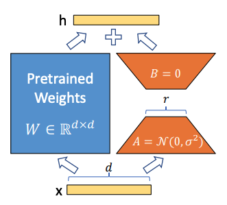
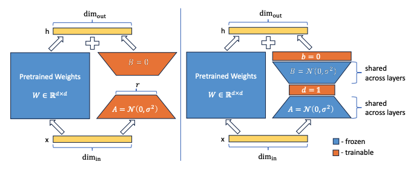
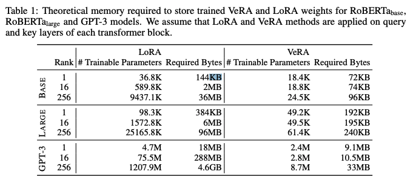
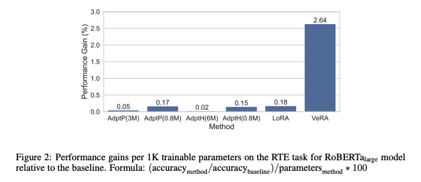
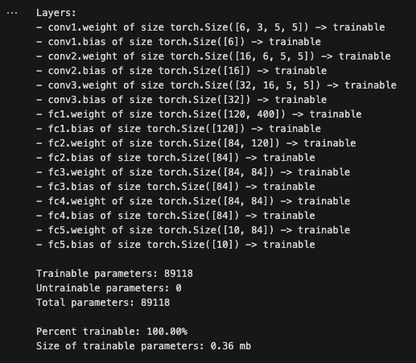
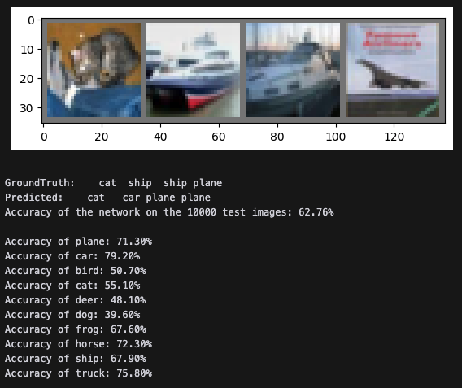
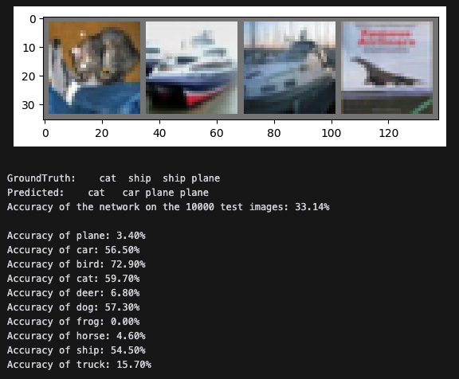

You can find all the source code for this implementation in [this repo](https://github.com/davisgcii/vera-from-scratch) on my [GitHub profile](https://github.com/davisgcii).

Note: This post has some technical bits but the key takeaways should be understandable and valuable even to those without any machine learning background!

Edit: Looks like VeRA is being added to the [Hugging Face PEFT library](https://github.com/huggingface/peft/pull/1039).

# Intro

Last week, the University of Amsterdam and Qualcomm AI Research published an interesting paper on a new finetuning method called vector-based random matrix adaptation, or [VeRA](https://arxiv.org/pdf/2310.11454.pdf). Like low-range adaptation (LoRA), VeRA allows you to efficiently finetune a large model by freezing the model’s weights, injecting a small number of trainable parameters into the model, and training the updated model on the new task.

VeRA is unique in that it is more forward-looking and much more efficient than LoRA, while still achieving the same or better performance.


As a continuation of my *Learning in Public* series, I’ve spun up a quick and dirty implementation of VeRA to validate my understanding and share with others what I’m learning as I’m learning it.

# Quick recap on LoRA

A few weeks ago, I wrote about my experience building a [quick and dirty implementation of the low-range adaptation (LoRA) finetuning method](https://gcdavis.substack.com/p/more-efficient-finetuning). A quick recap of how LoRA works:

> - Pick a pretrained model
> - Freeze all of the weights
> - Pick some of the now-untrainable linear layers in the model; for each layer, create trainable auxiliary matrices **A** and **B** of shape `(in_dim,rank)` and `(rank,out_dim)` such that (`A@B).shape == layer.shape` and `rank` is a small value (somewhere between 1 and 256)
> - Add the product to the layer’s weights
> - Finetune the model, training only the small auxiliary matrices
> - That’s it!



A diagram from the [LoRA paper](https://arxiv.org/pdf/2106.09685.pdf) demonstrating how the auxiliary A and B matrices are used to adapt pretrained weights in a model

To summarize why LoRA is useful:

> - To download or share a finetuned model, you only need to download or share the trained auxiliary matrices (or *deltas*) instead of the entire model. This means downloading a few MB instead of tens or hundreds of GB.
> - You can take a base pretrained model (like Llama-2-70b) and efficiently finetune it for multiple downstream tasks. You can then swap out a few MB on the fly as required depending on the downstream task your trying to perform. This means you could have many differently fine tuned models that only take up the space of one. As LLMs-on-the-edge become prevalent, I expect that the ability to quickly swap between finetuned models will become more and more important.
> - LoRA makes finetuning much more efficient because there are fewer gradient calculations for the same level of finetuned performance.
> - To deploy a LoRA-trained model, just add the weight deltas to the frozen pretrained weights and you’re good to go — there is no added latency.

## Still too much memory?

Looking forward, it’s easy to see a world where large language and multimodal models become more and more ubiquitous in our everyday lives — individual apps may use differently finetuned models for different parts of the same product, and models may be finetuned individually for each user.

For example, imagine a “cloud-based operating system assistant that continuously learns from and adapts to individual user behaviors and feedback”.[^1] If the model powering this system was roughly the size of GPT-3 and LoRA was used to finetune a different version for each user (applying LoRA only to the query and value matrices in the model’s transformer blocks), then each version would have nearly 300MB of auxiliary matrix weights. With a million users, this equates to nearly 300TB of stored weight deltas.

This is actually the problem that motivated the authors of the VeRA paper to find an even more efficient finetuning method.

But is it actually useful? Is 300TB really too much data for an organization with one million users to handle? I would guess not — any company that stores any non-text user data (like images or docs) likely has a few hundred MB of data per user.

In any case, VeRA is a cool concept that makes finetuning even simpler and more lightweight.

# Vector-based random matrix adaptation

## How does VeRA work?

VeRA is similar to LoRA in that auxiliary matrices are created for each linear layer that is to be finetuned. For a linear layer of shape `(in_dim,out_dim)`, the auxiliary matrices **A** and **B** have shapes `(in_dim,rank)` and `(rank,out_dim)` respectively.

In LoRA, the rank is small (thus *low-rank* *adaptation*) and the auxiliary matrices are trained, multiplied, and added to the layer’s pretrained weights — this is what allows a small number of parameters to approximate a much larger weight matrix.

VeRA, on the other hand, does not require `rank` to be small and the auxiliary matrices are not trained at all — they are actually frozen and untrainable! Instead, two trainable scaling vectors **d** and **b** are used to scale the frozen auxiliary matrices. Moreover, the auxiliary **A** and **B** matrices are *shared* between all linear layers of the same shape, further reducing the memory footprint.

Let’s look at this in more detail by comparing how a set of linear layers would be finetuned with LoRA vs. VeRA.



A comparison of LoRA (left) and VeRA (right) from the [VeRA paper](https://arxiv.org/pdf/2310.11454.pdf). In LoRA, the auxiliary matrices are fully trainable. In VeRA, they are frozen and shared across the model, and instead each layer has unique scaling vectors **b** and **d** that are trainable.

## An example

Let’s say that we have four linear layers that receive a set of image features (`img_dim=80`) and attempt to classify the image into one of 10 classes:

- `layer1.shape=(80,120)`
- `layer2.shape=(120,120)`
- `layer3.shape=(120,120)`
- `layer4.shape=(120,10)`

Each linear layer will have `in_dim*out_dim` weights and `out_dim` biases. This gives a total of 39,970 trainable parameters.

#### LoRA

Let’s look at how we would use LoRA to finetune this model, assuming that we are finetuning every linear layer and are using `rank=16`:

1. First, freeze all of the parameters
2. Second, create auxiliary matrices for each layer with dimensions `A.shape=(in_dim,rank)` and `B.shape=(rank,out_dim)`

   1. note: auxiliary matrices only have weights, no biases
   2. note: **A** is initialized with a kaiming uniform distribution and **B** is initialized with zeros
3. Inject these matrices into their respective layers such that the new output of each layer for an input `x` is equal to `x@(layer.weights + A@B)+layer.biases`
4. Train the model, updating only the auxiliary matrices

With LoRA, each layer has `rank*(in_dim + out_dim)` new parameters, and all are trainable — for this example, this gives a total of 12,960 trainable parameters, or 24% of the new total parameter count. As the model gets bigger, the percentage of parameters that are trainable will drop precipitously.

#### VeRA

Now, let’s take a look at VeRA, assuming that `rank` is still 16 and we are adapting every linear layer:

1. Freeze all parameters
2. Create auxiliary matrices for each group of layers that shares the same dimensions — this means we would have only three sets of auxiliary matrices (since `layer.2` and `layer.3` have the same shape and would share one set)

   1. note: both **A** and **B** are initialized with kaiming uniform initialization here
3. Freeze these auxiliary matrices
4. For each layer, create trainable **d** and **b** vectors of shape `(rank,)` and `(out_dim,)` respectively

   1. note: **d** is initialized with some constant value (a tunable hyperparameter, in this case 1) and **b** is initialized with zeros
5. Inject the auxiliary matrices and scaling vectors into their respective layers such that the new output of each layer for an input `x` is equal to `x@(layer.weights+(A@d)@(B@b))+layer.biases`

   1. note: the scaling vectors are broadcasted during matrix multiplication to match the shapes of their auxiliary matrices and scale them correctly
6. Train the model, updating only the scaling vectors

With VeRA, each layer has only `(rank+out_dim)` trainable parameters. For this example, this equates to 434 trainable parameters. We also added three sets of auxiliary matrices for an additional 9,120 untrainable parameters. In the end, only 434 out of 49,524 total parameters are trainable — just 0.9%.

### Performance

Finetuning with VeRA achieves roughly the same performance as finetuning with LoRA or other finetuning methods like full finetuning, bitfit, and adapter tuning, while using significantly less memory. In the example from the intro where LoRA would create nearly 300MB of new parameters for a finetuned GPT-3, VeRA would only create 10MB.



On a per-trainable-parameter basis, VeRA achieves a much higher performance gain than any other parameter efficient finetuning method.



## Takeaways

- VeRA achieves similar or better performance to other finetuning methods while also using significantly less memory
- VeRA also retains all of the same benefits offered by LoRA — namely:

  - a single pre-trained model can efficiently be finetuned to build many different VeRA modules for different downstream tasks
  - you can efficiently switch tasks by freezing the shared model and swapping out the auxiliary matrices and scaling vectors
  - training is more efficient because you don’t need to calculate the gradients for the vast majority of parameters
  - there is no added latency during inference

# Implementation

Here’s a quick overview of my implementation.

Just like with my LoRA implementation, we’ll start by downloading and preparing the CIFAR10 dataset — this consists of 60,000 32x32 color images in 10 classes, with 6,000 images per class. There are 50,000 training images and 10,000 test images. I’ll be using the same data augmentation and normalization as the LoRA implementation, so we'll just copy that code over.

Next up, I’ll build and train a simple convolutional neural network — this is what we’ll finetune later. We’ll want to include a mix of linear layers — some with the same shape — so that we can test sharing auxiliary matrices between linear layers.

```
class ConvNet(nn.Module):
    def __init__(self):
        super().__init__()
        # network layers defined below
        self.conv1 = nn.Conv2d(
            3, 6, 5
        ) # 3 input channels, 6 output channels, 5x5 kernel
        self.pool = nn.MaxPool2d(2, 2)  # 2x2 kernel, stride of 2
        self.conv2 = nn.Conv2d(
            6, 16, 5
        ) # 6 input channels, 16 output channels, 5x5 kernel
        self.pool = nn.MaxPool2d(2, 2)  # 2x2 kernel, stride of 2
        self.conv3 = nn.Conv2d(
            16, 32, 5
        ) # 16 input channels, 32 output channels, 5x5 kernel
        self.fc1 = nn.Linear(
            16 * 5 * 5, 120
        ) # 16 * 5 * 5 input features, 120 output features
        self.fc2 = nn.Linear(120, 84)  # 120 input features, 84 output features
        self.fc3 = nn.Linear(84, 84)
        self.fc4 = nn.Linear(84, 84)
        self.fc5 = nn.Linear(84, 10)  # 84 input features, 10 output features

    def forward(self, x):  # define the forward pass
        x = self.pool(F.relu(self.conv1(x)))  # convolve, apply ReLU, then pool
        x = self.pool(F.relu(self.conv2(x)))  # convolve, apply ReLU, then pool
        x = torch.flatten(x, 1)  # flatten all dimensions except batch
        x = F.relu(self.fc1(x))  # apply ReLU
        x = F.relu(self.fc2(x))  # apply ReLU
        x = F.relu(self.fc3(x))
        x = F.relu(self.fc4(x))
        x = self.fc5(x)  # output layer
        return x
```

After writing a quick helper function, let’s see how many layers and parameters there are in this model. To start, there are around 89,000 parameters and all are trainable.



After training the base CNN for 6 epochs with a batch size of 4, we get an overall accuracy of around 63% across the 10 classes.



Alright, now let’s implement the `VeRALinear` class. This will be a bit different from the `LoRALinear` class in my previous implementation because auxiliary matrices can be shared between different linear layers of the same size. As a result, we’ll have to feed in the auxiliary matrices as arguments when initializing each VeRA layer.

```
# let's build out VeRA layer
class VeRALinear(nn.Module):
    """
    This is an implementation of vector-based random matrix adaptation. This is similar to LoRA, with the primary difference being that the low-rank matrices are randomly initialized and frozen, and instead two small vectors b and d are trained.

    Because the low-rank matrices A and B are shared across all layers of the same size, they must be provided as arguments to the constructor.

    :param module: The linear layer module to adapt.
    :param A: The auxiliary matrix A.
    :param B: The auxiliary matrix B.
    """

    def __init__(
            self,
            module: nn.Module,
            A: torch.Tensor,
            B: torch.Tensor,
            d_init: float = 1.0,
    ):
        # ensure that the input module is a linear layer
        assert isinstance(module, nn.Linear), "VeRALinear can only be applied to linear layers"

        super().__init__()
        self.in_dim = module.in_features # input dimension
        self.out_dim = module.out_features # output dimension
        self.A = A # auxiliary matrix A
        self.B = B # auxiliary matrix B
        self.rank = A.shape[1] # rank of the low-rank matrices
        self.d_init = d_init # initial value for d

        # ensure that A and B are of the right shape
        # A should be (in_dim, rank) and B should be (rank, out_dim)
        # where in_dim is module.in_features, out_dim is module.out_features, and rank is the rank of the low-rank matrice
        assert A.shape == (self.in_dim, self.rank), f"A should be of shape {(self.in_dim, self.rank)}"
        assert B.shape == (self.rank, self.out_dim), f"B should be of shape {(self.rank, self.out_dim)}"        

        # recreate the linear layer and freeze it
        # note: we will copy over the pretrained weights after initializing
        self.pretrained = nn.Linear(self.in_dim, self.out_dim, bias=True)
        self.pretrained.weight = nn.Parameter(module.weight.detach().clone())
        self.pretrained.bias = nn.Parameter(module.bias.detach().clone())
        self.pretrained.weight.requires_grad = False # freeze the weights
        self.pretrained.bias.requires_grad = False # freeze the bias

        # initialize the d vector of shape (1, rank) with all values equal to d_init
        self.d = nn.Parameter(torch.full((1, self.rank), d_init))

        # initialize b vector of shape (1, out_dim) with all values equal to 0
        self.b = nn.Parameter(torch.zeros(1, self.out_dim))

        self.d.requires_grad = True
        self.b.requires_grad = True

    def forward(self, x: torch.Tensor) -> torch.Tensor:
        """
        Forward pass of the VeRALinear layer.

        :param x: The input tensor.
        :return: The output tensor.
        """
        # compute the output of the pretrained linear layer
        pretrained_out = self.pretrained(x) # get the pretrained weights

        # scale self.A by self.d; size is (in_dim, rank)
        scaled_A = self.A * self.d.view(1, -1)
        assert scaled_A.shape == (self.in_dim, self.rank), f"scaled_A should be of shape {(self.in_dim, self.rank)}. Got {scaled_A.shape} instead."

        # scale self.B by self.d; size is (rank, out_dim)
        scaled_B = self.B * self.b.view(1, -1)
        assert scaled_B.shape == (self.rank, self.out_dim), f"scaled_B should be of shape {(self.rank, self.out_dim)}. Got {scaled_B.shape} instead."

        out = x @ (scaled_A @ scaled_B)
        assert out.shape == pretrained_out.shape, f"out should be of shape {pretrained_out.shape}. Got {out.shape} instead."

        return pretrained_out + out
```

Finally, we’ll implement a function to take a pretrained pytorch model and convert its linear layers into `VeRALinear` layers.

```
def createVeRAModel(model: nn.Module, rank: int=4, device: str='cpu', aux_matrices: dict={}):
    """
    Modify a pretrained model in place to create a VeRA model. This is done by modifying each nn.Linear layer in the model to a VeRALinear layer. All nn.Linear layers of the same shape share the same A and B auxiliary matrices.

    :param model: The pretrained model.
    :param device: The device to move the model to.
    """
    # make sure there are no VeRALinear layers in the model; return if there are
    for _, module in model.named_modules():
        if isinstance(module, VeRALinear):
            print("Model already contains VeRALinear layers")
            return
        
    # freeze all parameters in the model
    freeze_params(model)

    # iterate over all layers; determine the set of shapes of all linear layers in the model
    shapes = set()
    for _, module in model.named_children():
        if isinstance(module, nn.Linear):
            shapes.add((module.in_features, module.out_features))
    
    # for each shape, create auxiliary matrices A and B
    # A should be of shape (in_dim, rank) and B should be of shape (rank, out_dim)
    # A and B should both be initialized with kaiming_uniform_
    for shape in shapes:
        in_dim, out_dim = shape
        A = torch.empty((in_dim, rank)).to(device)
        B = torch.empty((rank, out_dim)).to(device)
        nn.init.kaiming_uniform_(A)
        nn.init.kaiming_uniform_(B)
        aux_matrices[shape] = (A, B)

    
    for name, module in model.named_children():
        if isinstance(module, nn.Linear):
            # get the shape of the current linear layer
            shape = (module.in_features, module.out_features)

            # create the VeRALinear layer
            vera = VeRALinear(module, *aux_matrices[shape])

            # replace the current linear layer with the VeRALinear layer
            setattr(model, name, vera)
            print(f"Replaced {name} with VeRALinear layer")
        else: # recursively call on the module if it is not a linear layer because it may contain linear layers
            createVeRAModel(module, rank, device, aux_matrices)

    # move the model to the device
    model.to(device)

    # unfreeze the d and b vectors in the model
    unfreeze_VeRA_vectors(model)
```

Ok, now let’s convert our CNN into a CNN with `VeRALinear` layers.

```
# create a copy of the existing network
vera_net = ConvNet()

# copy over the pretrained weights
vera_net.load_state_dict(net.state_dict())

# create the VeRA model
createVeRAModel(vera_net, rank=32, device=device)
print_params(vera_net)
print(f"There are {len(countAuxMatrixPairs(vera_net))} unique auxiliary matrix pairs in the model")
```

```
Replaced fc1 with VeRALinear layer
Replaced fc2 with VeRALinear layer
Replaced fc3 with VeRALinear layer
Replaced fc4 with VeRALinear layer
Replaced fc5 with VeRALinear layer
Layers:
- conv1.weight of size torch.Size([6, 3, 5, 5]) -> untrainable
- conv1.bias of size torch.Size([6]) -> untrainable
- conv2.weight of size torch.Size([16, 6, 5, 5]) -> untrainable
- conv2.bias of size torch.Size([16]) -> untrainable
- conv3.weight of size torch.Size([32, 16, 5, 5]) -> untrainable
- conv3.bias of size torch.Size([32]) -> untrainable
- fc1.d of size torch.Size([1, 32]) -> trainable
- fc1.b of size torch.Size([1, 120]) -> trainable
- fc1.pretrained.weight of size torch.Size([120, 400]) -> untrainable
- fc1.pretrained.bias of size torch.Size([120]) -> untrainable
- fc2.d of size torch.Size([1, 32]) -> trainable
- fc2.b of size torch.Size([1, 84]) -> trainable
- fc2.pretrained.weight of size torch.Size([84, 120]) -> untrainable
- fc2.pretrained.bias of size torch.Size([84]) -> untrainable
- fc3.d of size torch.Size([1, 32]) -> trainable
- fc3.b of size torch.Size([1, 84]) -> trainable
- fc3.pretrained.weight of size torch.Size([84, 84]) -> untrainable
- fc3.pretrained.bias of size torch.Size([84]) -> untrainable
- fc4.d of size torch.Size([1, 32]) -> trainable
- fc4.b of size torch.Size([1, 84]) -> trainable
- fc4.pretrained.weight of size torch.Size([84, 84]) -> untrainable
- fc4.pretrained.bias of size torch.Size([84]) -> untrainable
- fc5.d of size torch.Size([1, 32]) -> trainable
- fc5.b of size torch.Size([1, 10]) -> trainable
- fc5.pretrained.weight of size torch.Size([10, 84]) -> untrainable
- fc5.pretrained.bias of size torch.Size([10]) -> untrainable

Trainable parameters: 542
Untrainable parameters: 89118
Total parameters: 89660

Percent trainable: 0.60%
Size of trainable parameters: 0.00 mb
There are 4 unique auxiliary matrix pairs in the model
```

Before going any further, let’s make sure the parameter count makes sense. These are the four linear layers we had:

1. `fc1.shape=(400,120)`
2. `fc2.shape=(120,84)`
3. `fc3.shape=(84,84)`
4. `fc4.shape=(84,84)`
5. `fc5.shape=(84,10)`

Each linear layer should have `(rank + out_dim)` new trainable parameters, and there should be four new auxiliary matrix sets, each with `rank*(in_dim + out_dim)` frozen parameters. Note that I used `rank=32` in my implementation.

- `fc1` → 152 new trainable parameters
- `fc2` → 116 new trainable parameters
- `fc3` and `fc4` → 232 new trainable parameters
- `fc5` → 42 new trainable parameters

This provides a total of 542 new trainable parameters — exactly what we’d expect. Note that I will need to go back and modify `print_params()` as it is not counting the parameters in the A and B auxiliary matrices. Ideally, I’d like to make sure that the shared auxiliary matrices are actually at the same location in memory.

Finally, we’ll finetune the updated model on just three classes — `cat`, `bird`, and `dog`. After ensuring that the trainable scaling vectors have actually changed, we’ll test the model and validate that the finetuning worked with our new VeRALinear layers:



As expected, classification accuracy increased for the three classes we finetuned on and decreased for all other classes.

# Conclusion

VeRA works! If I have time, I might go back and try to compare it against LoRA on a larger model with more compute — this would provide an opportunity to validate the authors’ comparison results against LoRA and other techniques.

If you have any questions or comments, and especially if you notice that I did anything wrong, please feel free to dm me or submit an issue on the repo!

### Further work

- go back and update `print_params()` to also check parameter location in memory
- use a random seed to generate the auxiliary matrices in a fixed manner (will save even more memory)
- ensure that I’m actually sharing the auxiliary matrices between same-sized linear layers
- test a larger model with more compute to validate LLM finetuning results

Thank you for reading On the Rocks. This post is public so feel free to share it.


<hr />

<div class="footnotes">

[^1]: [VeRA: Vector-Based Random Matrix Adaptation](https://arxiv.org/pdf/2310.11454.pdf) *[(Kopiczko et al., 2023)](https://arxiv.org/pdf/2310.11454.pdf)*

</div>
