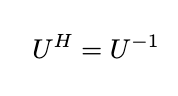
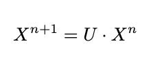
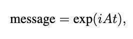
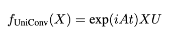
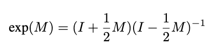
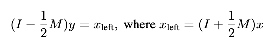
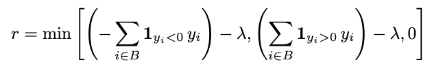
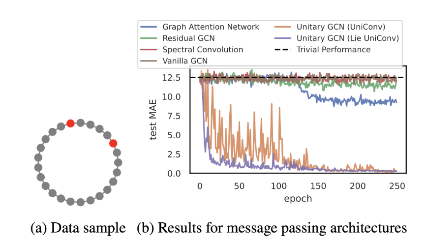
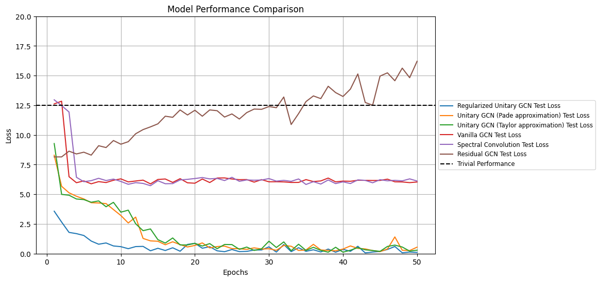
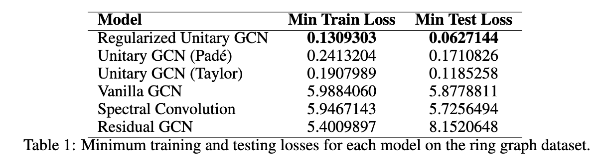

The post below is an edited version of a blog post I submitted as part of a group for [CS224W](https://web.stanford.edu/class/cs224w/) at Stanford. That being said, it’s not too dissimilar from my previous posts—much like before, this project was an attempt to understand, replicate (in part), and extend interesting research that someone else performed. I’m posting it here (with permission from my group-mates) as a continuation of my *Learning in Public* series.

The first time I heard of graph learning was in the summer of 2023. I was working on a startup in the fraud and risk management space after graduating from the GSB, and graphs seemed like a good way to model (and predict) the fraudulent relationships between people, websites, etc. While the startup attempt fizzled out, the topic continued to interest me; once I kicked off my part-time MSEE at Stanford, I decided to sign up for the class.

My main takeaway was that graph learning is, like most deep learning, pretty simple. To predict some property of a node or edge, you look at the neighboring nodes and edges, aggregate some information about them, and update your representation of the entity in question.

For our final project, we thought it would be fun to pick a recent NeurIPS research paper and implement or extend it. We chose the paper below because it attempts to address one of the primary challenges of graph neural networks—oversmoothing.

This post is a bit more academic than my previous ones, but it should still be interesting and I think is worth sharing. Enjoy :)

---

> **Unitary Convolutions for Learning on Graphs and Groups**. For our CS224w final project, we chose to extend *[Unitary Convolutions for Learning on Graphs and Groups](https://arxiv.org/abs/2410.05499)* [1], a recent NeurIPS 2024 pre-print that introduces **unitary group convolutions** to address oversmoothing in graph neural networks (GNNs). This technique maintains unique node representations at greater network depths by using norm-preserving transformations, enhancing model expressivity and stability. Our implementation adds new exponential map calculations and regularization to optimize the calculation of matrix exponentials and improve model robustness.
>
> Find the link to our code and colab [here](https://colab.research.google.com/drive/1x-INIU7HbjxmSlztBC0NEGrBg96Qb97d?usp=sharing).

---

# Introduction

Increasing the depth of a GNN can enhance its expressive power but can also lead to **oversmoothing**. Oversmoothing occurs when node embeddings converge to a uniform or constant distribution, making them indistinguishable from each other [2, 3]. This reduces the GNN’s expressive power and its effectiveness in downstream tasks.

This issue arises in message-passing neural networks (MPNNs) as nodes repeatedly update their embeddings by aggregating information from neighboring nodes within *n* layers or “hops”. The equation below characterizes a basic graph convolution network (GCN) where the representation *h* of node *v* at layer *n, h\_v^n*, is formed by aggregating “messages” from the node’s neighbors (performing a weighted sum of the neighbor representations in the previous layer).


As the number of layers *n* grows, nodes incorporate features from an increasingly broad subset of the graph, causing their representations to become more similar. Mathematically, oversmoothing can be quantified by a node-similarity measure that captures the similarity of node features across the graph. If this measure decays exponentially towards zero as the network depth increases, it indicates that node embeddings are converging to a homogeneous state.

One common node similarity measure is the **Dirichlet energy**, which measures the total variation in feature values across all edges in the graph at a given layer. The more similar neighboring nodes are, the lower the Dirichlet energy. If the Dirichlet energy decreases as the number of layers in the network increases, this signals that the node representations are becoming homogeneous and that oversmoothing is occurring [3].

There are several solutions to oversmoothing:

- **Rewiring** modifies message-passing pathways by adding or removing edges or adjusting edge weights. However, it is computationally expensive and may not generalize well across graphs, as optimal rewiring strategies can be graph-specific.
- **Skip (or residual) connections** add each node’s previous layer embeddings to its current layer embeddings, helping to maintain distinctive representations for each node as the network depth increases. Although this approach preserves information from earlier layers, it serves as a workaround rather than a complete solution to oversmoothing.
- **Regularization** can reduce oversmoothing explicitly (by penalizing deviations of oversmoothing measures during training) or implicitly (by adding noise to the optimization process). An example of implicit regularization is DropEdge, which randomly drops edges of the underlying graph during training [4]. Most of these techniques mitigate oversmoothing by slowing down message passing, but don’t eliminate it entirely.

## Introducing unitary convolutions

To address oversmoothing more directly, the preprint introduces **unitary group convolutions**. In a GCN, a **convolution** is the act of aggregating and transforming the features of a node’s neighbors to create an updated representation for the node being evaluated. As described above, this aggregation leads to oversmoothing.

Unitary convolutions help prevent oversmoothing by replacing the standard GCN convolution operator with a **unitary operator**. This change introduces two important properties: norm-preservation and invertibility.

- **Norm-preserving** means that the length (or norm) of each feature vector remains constant throughout transformations. This prevents vanishing and exploding gradients, and helps maintain stability as more layers are added to the network.
- **Invertible** means that every transformation applied to the features can be reversed. This means that the transformation does not destroy any of the original feature information — the information is redistributed instead. This prevents the gradual degradation of feature diversity that leads to oversmoothing.

Unitary convolutions use unitary matrices — matrices with an inverse equal to their conjugate transpose — in the transformation process.



The transformation in a unitary convolution can be represented as:



where *U* is a unitary matrix and *X^n* is a feature vector at layer *n* in a GCN.

The paper introduces two types of unitary convolutions: **separable unitary convolutions** (`UniConv`) and **Lie orthogonal unitary convolutions** (`LieUniConv`). For the purposes of this blog post, we will only consider `UniConv`.

`UniConv` modifies the standard message-passing process in GNNs by applying norm-preserving and invertible transformations separately on node features and to the message-passing process. This occurs over two steps:

- First, a unitary matrix *U* is applied to the node features, ensuring the transformations are norm-preserving and invertible.
- A separate unitary operator is used in the message-passing process by applying it to the adjacency matrix. The paper does this by using the modified exponential of the adjacency matrix *A*:



In whole, `UniConv` works as follows: given an undirected graph *G* with *n* nodes and adjacency matrix *A*, UniConv takes the form:



where *U* is the unitary operator operating on the node features, is the imaginary (which ensures the operation is unitary), and *t* controls the magnitude of the convolution.

# Implementation

## Pade approximation

One of the main technical challenges with unitary graph convolutions is calculating the matrix exponential for large graphs.

In the original paper, the authors used a Taylor series approximation of the exponential function. While this approach works, it also has some limitations: it does not guarantee a unitary result and can still be computationally demanding if high precision is needed.

One alternative is to use a Pade approximation, which the preprint identified as an area for further exploration, to approximate the exponential. The first-order Pade approximant (also known as the Cayley transform) takes the form:



The key advantage of this approach is that the Pade approximant always returns a fully unitary operator when applied to skew-Hermitian matrices (square matrices with complex entries with a conjugate transpose equal to the negative of the original matrix).

However, this approach also introduces a challenge: For large graphs, computing the inverse (the `(I-0.5M)^(-1))` term) is computationally infeasible as it has an algorithmic complexity of *~O(n³)*. To address this, we used an iterative approach based on the Neumann series which solves the following system:



We began by implementing a `PadeGCNConv` class which wraps a base convolution operation inside the Pade approximation logic:

```python

class PadeGCNConv(MessagePassing):
    """
    A message passing layer that implements the Pade approximation to approximate
    the exponential map in unitary convolutions. It iteratively solves for
    (I - 0.5M)^{-1}, ensuring more stable unitary-like message passing.
    """

    def __init__(self, conv: ComplexGCNConv, return_real: bool = False, **kwargs):
        super().__init__(**kwargs)
        self.conv = conv
        self.return_real = return_real

    def forward(
        self, x: Tensor, edge_index: Adj, edge_weight: OptTensor = None, **kwargs
    ) -> Tensor:

        # apply initial linear transformation
        x = self.conv(
            x, edge_index, edge_weight, apply_feature_lin=True, return_feature_only=True
        )

        # apply Cayley transform: (I + 0.5 * M) x =(I - 0.5 * M)^{-1} x
        # approximate the inverse using a few iterations of the Neumann series
        num_iterations = 5
        Mx = self.conv(x, edge_index, edge_weight, apply_feature_lin=False, **kwargs)
        x_left = x + 0.5 * Mx

        # initialize y
        y = x_left.clone()

        # iteratively solve (I - 0.5 * M) y = x_left
        for _ in range(num_iterations):
            My = self.conv(
                y, edge_index, edge_weight, apply_feature_lin=False, **kwargs
            )
            y = x_left + 0.5 * My

        out = y

        if self.return_real:
            out = out.real
        return out
```

To break down how this works:

1. We first compute the left side `x_left=(I+0.5*M)*x` by applying the graph convolution to get `M*x` and then adding `x`.
2. We use fixed-point iteration to solve `(I-0.5*M)y=x_left`. Each iteration updates `y` using `y_(k+1)=x_left+0.5*M*y_k`.
3. This iteration converges because `||0.5 * M||<1` is due to the fact that the adjaceny matrix is normalized.

We wrap this implementation in a `PadeUnitaryGCNConvLayer` layer that handles added functionality like dropout, optional residual connections, and complex-valued activation functions.

```python

class PadeUnitaryGCNConvLayer(nn.Module):
    """
    A single graph convolutional layer utilizing the Pade approximation
    for unitary transformations. This layer:
      - Applies complex-valued GCN convolutions using a Pade approximant.
      - Optionally includes a residual connection.
      - Applies a complex activation and dropout.
    """

    def __init__(
        self,
        dim_in,
        dim_out,
        dropout=0.0,
        residual=False,
        global_bias=True,
        use_hermitian=False,
        activation=torch.nn.ReLU,
        **kwargs,
    ):
        super().__init__()
        self.dim_in = dim_in
        self.dim_out = dim_out
        self.dropout = dropout
        self.residual = residual
        if global_bias:
            self.bias = torch.nn.Parameter(torch.zeros(dim_out, dtype=torch.cfloat))
        else:
            self.register_parameter("bias", None)

        if use_hermitian:
            base_conv = HermitianGCNConv
        else:
            base_conv = ComplexGCNConv

        self.act = nn.Sequential(
            ComplexActivation(activation()),
            ComplexDropout(self.dropout),
        )
        self.model = PadeGCNConv(base_conv(dim_in, dim_out, **kwargs))

    def forward(self, batch):
        x_in = batch.x

        x = self.model(batch.x, batch.edge_index)
        if self.bias is not None:
            x = x + self.bias

        x = self.act(x)

        if self.residual:
            x = x_in + x  # residual connection
        batch.x = x
        return batch
```

Finally, we implement the full GCN using the Pade approximation (`UnitaryConvPadeGCN`):

```python

class UnitaryConvPadeGCN(nn.Module):
    """
    A multi-layer GCN built from Pade-based unitary convolutional layers. It stacks
    several PadeUnitaryGCNConvLayer layers, followed by a global pooling, gelu activation,
    and linear layer.
    """

    def __init__(
        self,
        input_dim: int,
        hidden_dim: int,
        output_dim: int,
        num_layers: int,
        hidden_layer_dim: int,
        T: int = 15
    ):
        super(UnitaryConvPadeGCN, self).__init__()
        self.num_layers = num_layers
        self.conv_layers = nn.ModuleList()
        taylor_layer = PadeUnitaryGCNConvLayer(input_dim, hidden_dim, global_bias = False, bias = False, use_hermitian=False)
        self.conv_layers.append(taylor_layer)
        for _ in range(num_layers-1):
            taylor_layer = PadeUnitaryGCNConvLayer(hidden_dim, hidden_dim, global_bias = False, bias = False, use_hermitian=False, activation = GroupSort)
            self.conv_layers.append(taylor_layer)
        self.hidden_layer = nn.Linear(hidden_dim, hidden_layer_dim)
        self.output_layer = nn.Linear(hidden_layer_dim, output_dim)

    def forward(self, data):
        x, edge_index = data.x, data.edge_index
        for conv in self.conv_layers:
            data = conv(data)
        x = global_mean_pool(data.x.real, data.batch)  # global pooling over nodes
        x = F.gelu(self.hidden_layer(x)) # GELU activation
        x = self.output_layer(x)
        return x.squeeze()
```

## Regularization

Regularization, as defined in [5], is a technique used in neural networks to improve their ability to generalize. This paper performs a regularization over the training data, which augments the data fed into the layers of the neural network to expand the observed set of training examples. For a `y_i = tanh(x_i)` activation in which `y_i` represents the output of the *i*-th training sample’s activation function, where lambda is the minimum number of observations required on either side of the hyperplane, and *B*is the number of samples per batch. The regularization penalty, *r*, applicable to the entire training batch, is defined as:



In other words, this regularization component calculates a penalty derived from the node feature activations which is then integrated into the model’s training objective. This encourages more diversity in node representations which helps combat the tenancy for deep GCNs to oversmooth node features. Below is our implementation of our regularization class, `RegularizationLayer`:

```python

class RegularizationLayer(nn.Module):
    """
    Applies a regularization penalty to complex-valued activations to encourage balanced 
    distributions of node responses. This layer computes a penalty based on the difference
    between positive and negative activations, helping the model better generalize.
    """

    def __init__(self, threshold: float, cutoff: float):
        super(RegularizationLayer, self).__init__()
        self.threshold = threshold
        self.cutoff = cutoff

    def forward(self, activations, batch_size):
        """
        Computes the regularization penalty for complex-valued activations.
        """
        # Separate real and imaginary parts
        real_activations = activations.real
        imag_activations = activations.imag

        # Compute positive and negative activations
        positive_real = torch.sum(torch.clamp(real_activations, min=self.cutoff), dim=0)
        negative_real = torch.sum(torch.clamp(-real_activations, min=self.cutoff), dim=0)

        positive_imag = torch.sum(torch.clamp(imag_activations, min=self.cutoff), dim=0)
        negative_imag = torch.sum(torch.clamp(-imag_activations, min=self.cutoff), dim=0)

        # Combine real and imaginary activations
        positive_activation = positive_real + positive_imag
        negative_activation = negative_real + negative_imag

        # Node activation is the minimum of positive and negative
        node_activation = torch.min(positive_activation, negative_activation)

        # Regularization penalty
        penalty = torch.clamp(node_activation - self.threshold, max=0.0)
        reg_penalty = -torch.sum(penalty) / batch_size

        metrics = {
            "minimal_positive_activation": torch.min(positive_activation).item(),
            "minimal_negative_activation": torch.min(negative_activation).item(),
            "nodes_below_threshold": torch.sum(node_activation < self.threshold).item()
        }

        return reg_penalty, metrics
```

In combination with unitary convolutional layers (which help preserve the norm and invertibility of transformations) the model can maintain more distinct node-level information even at increasing network depths. Our full Regularized Unitary GCN class, `RegularizeUnitaryGCN`, is below:

```python

class RegularizeUnitaryGCN(nn.Module):
    """
    A Unitary GCN architecture that uses regularization to improve generalization.
    Stacks multiple unitary convolution layers and applies a RegularizationLayer
    penalty on the final embeddings, followed by global pooling and classification
    layers.
    """

    def __init__(
        self,
        input_dim: int,
        hidden_dim: int,
        output_dim: int,
        num_layers: int,
        hidden_layer_dim: int,
        T: int = 15,
        threshold: float = 0.1,
        cutoff: float = 0.0
    ):
        super(RegularizeUnitaryGCN, self).__init__()
        self.num_layers = num_layers
        self.conv_layers = nn.ModuleList()
        self.regularization_layer = RegularizationLayer(threshold, cutoff)

        # add convolution layers
        taylor_layer = UnitaryGCNConvLayer(input_dim, hidden_dim, T=T, global_bias=False, bias=False, use_hermitian=False)
        self.conv_layers.append(taylor_layer)
        for _ in range(num_layers - 1):
            taylor_layer = UnitaryGCNConvLayer(hidden_dim, hidden_dim, T=T, global_bias=False, bias=False, use_hermitian=False, activation=GroupSort)
            self.conv_layers.append(taylor_layer)

        self.hidden_layer = nn.Linear(hidden_dim, hidden_layer_dim)
        self.output_layer = nn.Linear(hidden_layer_dim, output_dim)

    def forward(self, data, batch_size=None):
        x, edge_index = data.x, data.edge_index

        for conv in self.conv_layers:
            data = conv(data)

        # compute regularization penalty
        reg_penalty, metrics = self.regularization_layer(data.x, batch_size)

        x = global_mean_pool(data.x.real, data.batch)  # global pooling
        x = F.gelu(self.hidden_layer(x))  # hidden layer
        x = self.output_layer(x) 

        return x.squeeze(), reg_penalty, metrics
```

# Results

## Data set

The experimental results from the original paper demonstrated the effectiveness of unitary convolutional networks in learning long-range dependencies using a toy dataset. This dataset consists of 1,000 ring graphs, each with 100 nodes. Each node has a one-dimensional feature vector, where all but two nodes are set to zero, and the two connected nodes are set to one. The task was to predict the distance between these two nodes on the ring graph. The unitary convolutional architectures succeeded where other models, such as graph attention networks and residual GCNs, struggled.



An example from the preprint illustrating how unitary GNNs outperform conventional message-passing networks in learning long-range dependencies. In this example, the task involves predicting the distance between two nodes in a ring graph of 100 nodes.

For this project, we also focused on testing our extensions using the ring graph dataset, which is particularly well-suited for evaluating a model’s ability to handle long-range dependencies. Beyond this toy setting, unitary GCNs from the original paper also performed competitively or surpassed state-of-the-art models on benchmark tasks, such as peptide classification and heterophilous graph datasets (graphs where nodes with different labels are more likely to be connected). However, these tasks were outside the scope of our testing.

Our results are broadly consistent with the findings from the original paper. As shown in below, unitary-based models excel at learning long-range dependencies while conventional message-passing networks struggle.



The results of testing our UniConv (with Pade approximation) and Regularized UniConv models against other GNN models, including the base UniConv (with Taylor approximation) model.



When we benchmarked our implementations, the Regularized Unitary GCN achieved the lowest test loss (0.0627), outperforming not only the classic GCN variants but also the other unitary approaches. This suggests that adding regularization to guide approximate unitarity can improve stability and performance. Both the Unitary GCN (with Taylor approximation), proposed in the preprint and the Unitary GCN (with Pade approximation) significantly outperformed standard and residual GCNs. Their test losses (0.1185 for Taylor, 0.1711 for Pade) were orders of magnitude lower than the vanilla GCN or spectral approach, which hovered around 5–6.

In contrast, non-unitary architectures exhibited poor performance, converging to higher text losses — often near or above trivial performance levels.

While the Pade approximation represents a promising improvement in efficiency, its test loss performance (0.1711) was slightly behind the original Taylor-based approach. To address this, we could approximate the Matrix inverse using more iterations of the Neumann series — this would make the Pade approximation more accurate, but also slower. With 5 iterations, it was about twice as fast as the Taylor approximation approach.

Overall, our results show that unitary GCNs — particularly with additional regularization — deliver strong performance on the ring graph task. They validate the original paper’s claims, confirming that unitarity-based approaches can help models overcome the intrinsic difficulties of learning long-range dependencies.

# Discussion

The experimental results of our project and the original preprint highlight the potential for Unitary GCNs to advance graph-based machine learning, specifically in areas that require stability and the ability to learn long-range dependencies.

By addressing oversmoothing through norm-preserving and invertible transformations, unitary convolutions maintain distinct node representations and enable deeper networks to effectively capture relationships across distant nodes. This capability is particularly helpful in applications such as social network analysis, biological network modeling, and infrastructure optimization, where long-range dependencies are important.

Although the scope of our project focused mainly on extending the preprint’s unitary GCN message passing architecture, the authors also performed a number of experiments over other benchmark datasets, namely the Long Range Graph Benchmark (LRGB) and the Heterophilous Graph Dataset. The benchmarks included a number of real-world tasks, including peptide function classification, node classification, and regression. The Unitary GCN model was competitive with other state of the art architectures on LRGB while Unitary GCN outperformed baseline message passing and graph transformer models on heterophilous graphs. All this to say, these findings reinforce the idea that unitary convolutions enhance the ability of convolutional networks to capture long-range dependencies.

The performance of our extensions to the author’s message passing architectures similarly show promise to these more ‘real-world’ tasks that rely on a model’s stability and ability to model long-range dependencies.

Adding regularization to Unitary GCNs also improved model robustness by penalizing oversmoothing and encouraging diversity in node embeddings. Future work could examine how well a regularized unitary GCN performs on heterophilous graphs where connected nodes differ slightly, such as user review networks or fraud detection. The stability afforded by regularization also has promise for domains requiring deep networks such as extensive social networks or deeper exploration of molecular interaction graphs.

Replacing Taylor Approximations with Pade Approximations resulted in slightly worse performance on the ring dataset but significantly decreased training time. Future work could explore where the trade-off between training time and performance might justify the use of the Pade approximation.

# Sources

[1] [Unitary Convolutions for Learning on Graphs and Groups](https://arxiv.org/html/2410.05499v1)  
[2] [Over-smoothing issue in graph neural network](https://towardsdatascience.com/over-smoothing-issue-in-graph-neural-network-bddc8fbc2472)  
[3] [A Survey on Oversmoothing in Graph Neural Networks](https://arxiv.org/pdf/2303.10993)  
[4] [DropEdge: Towards Deep Graph Convolutional Networks on Node Classification](https://openreview.net/forum?id=Hkx1qkrKPr)  
[5] [Evidence-Based Regularization for Neural Networks](https://www.mdpi.com/2504-4990/4/4/51)
