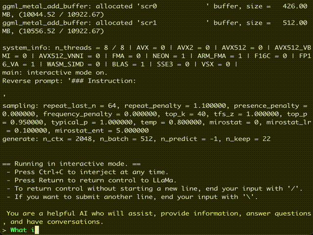
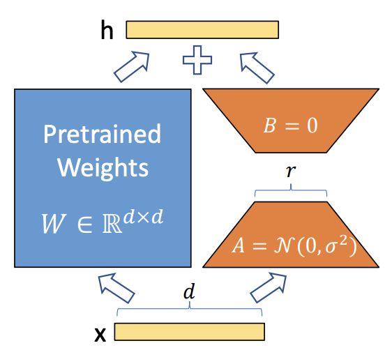
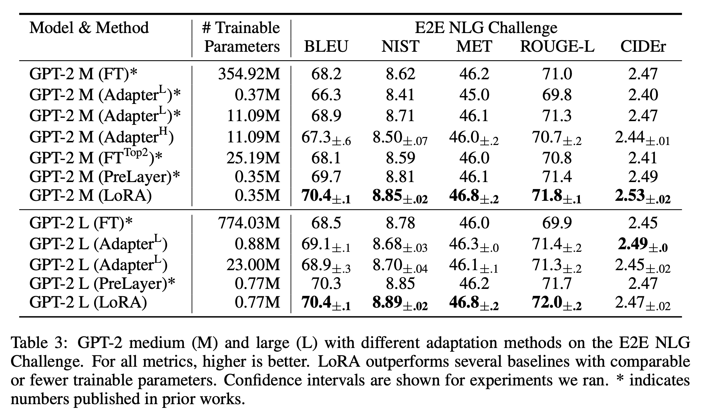
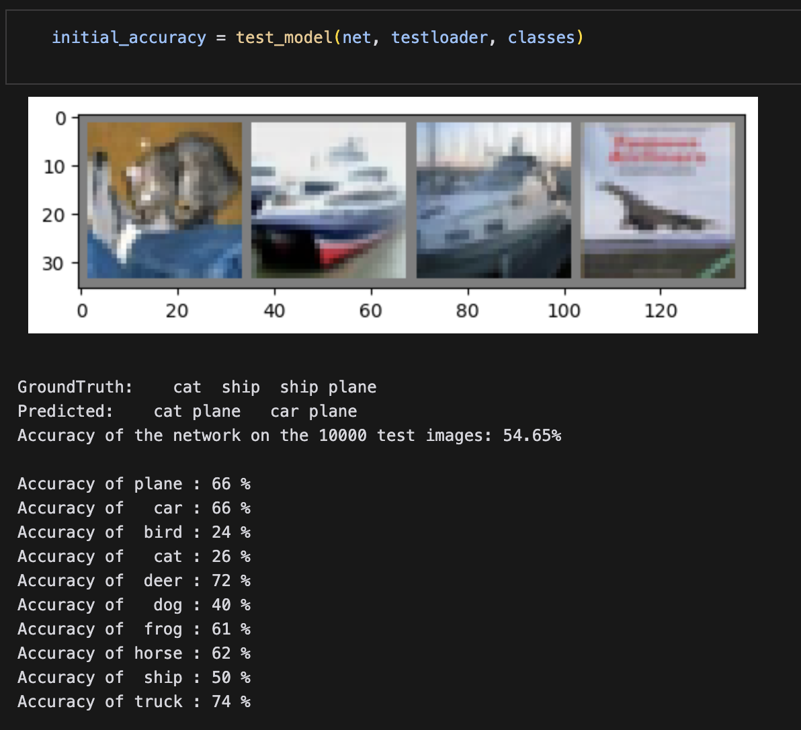
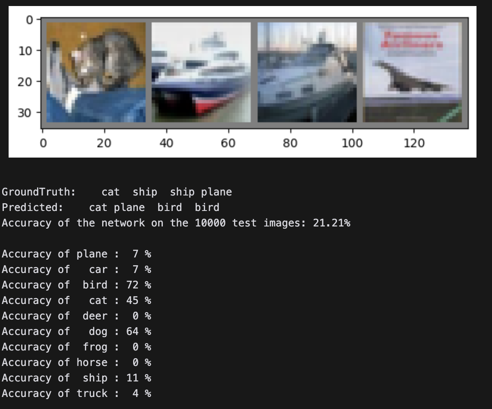

You can find all the source code for this implementation in [this repo](https://github.com/davisgcii/basicLoRA) on my [GitHub profile](https://github.com/davisgcii).

Note: This post has some technical bits but the majority should be understandable even for folks who don’t know the first thing about machine learning!

# Intro

I’ve had a lot of time on my hands recently and have managed to get back in the habit of reading (and hopefully understanding) machine learning research, perusing newsletters, listening to podcasts (I highly recommend [Latent Space](https://www.latent.space/)), and working on some side projects.

Of all of the interesting research and experimentation going on, one of the things I’ve found most fascinating is the work being done to make it possible to run large language models (LLMs) locally on your own devices. Thanks to [TheBloke](https://huggingface.co/TheBloke/Llama-2-13B-GGML), I can run the 13b-parameter [Llama-2](https://ai.meta.com/llama/) model — an LLM that is nearly comparable to [gpt-3.5-turbo](https://openai.com/blog/gpt-3-5-turbo-fine-tuning-and-api-updates) (the base ChatGPT model) — on my M2 MacBook Air at around 10 tokens per second! Considering that gpt-3.5-turbo was only released this Spring, the amount of progress being made is truly incredible!

Check out Llama-2-13b running on my M2 Air below ⬇️.



It takes a second to get started after providing the input…but when it goes, it goes!

How did I get to this post? While learning about why this level of local performance is now possible, I stumbled across a finetuning technique called quantized low-range adaptation (QLoRA). This led me to “normal” low-range adaptation (LoRA), which, after some research, seemed like an reasonable afternoon-sized project to try and implement.

# Some (not super technical) background

## Big numbers

You can think of LLMs or any other deep neural net as a bunch of numbers that get multiplied and added together. There’s a lot of other stuff that happens — sometimes, you might decide to only look at the largest of some of the numbers, or maybe some numbers are randomly set to zero — but in general, you smash a bunch of numbers together and get an output.

That output is typically a prediction based on the provided input. For example, a convolutional neural network (CNN) might take an input image, do a lot of math, and spit out a small series of numbers at the end which predict what the image is a *picture of*.

In order for these predictions to be accurate, we need to *train* the model. This means modifying all of those numbers inside so that when the pre-determined mathematical operations are carried out, the output has a higher likelihood of being correct.

All of those numbers inside the model are called *parameters*, and LLMs such as [Llama-2](https://ai.meta.com/llama/) or or [GPT-3](https://arxiv.org/abs/2005.14165) have tens to hundreds of **billions** of them. This sheer scale is one of the primary reasons that today’s large models can take millions of dollars to train and run (more parameters means more calculations, and more calculations means more compute) and up to hundreds of gigabytes of memory to store.

For example, if you want to train or run a LLM locally (on your computer, as opposed to remotely through ChatGPT or using an API), not only does your computer need to perform all of those calculations, but it also must store all of the numbers used to perform those calculations. Even smaller models, like Llama-2-13b, have around 9 GB of parameters. That’s a lot.

## What is finetuning?

To train a model, you *initialize* all of the parameters by setting them to small values (there is lots of research on how to best do this!), do the math (called a *forward pass*), and see what the output is. Typically, you compare that output to the desired output, and then go back and change the model’s parameters so that it does better next time (called the *backward pass*). You go through this cycle *many* times and *voila!*, your model is trained[^1].

If you decide you want to continue training your model toward a more specific task, you just continue the process, only using data geared toward that specific task. This is called *finetuning*.

For example, say you train a LLM for chat-based text completion (just like ChatGPT). A week later, maybe you decide that the chatbot is boring and you want it to respond with Shakespearean prose. To do this, you would take the model and its pretrained parameters, and then continue training it on lots of Shakespeare. This finetuning will continue to modify all of the parameters to make the output more like the examples you are training it on.

## To summarize

- Today’s LLMs easily have *billions* of numbers, called parameters, that they perform math on
- During *training*, lots of math is done to generate an output, the output is reviewed, the parameters are modified to make the output better, and the cycle repeats until the output is good enough
- During *inference*, you just do the forward pass to get the output — the parameters are already trained so you don’t need to update them anymore
- Modern consumer machines (like my M2 Air) can do calculations quickly enough to run inference on smaller models locally
- Unfortunately, most consumer machines aren’t really powerful enough to *train or even finetune* even small LLMs locally
- Fortunately, there are new techniques that make it easier and more efficient to finetune large models — this is where LoRA comes in

# What is LoRA?

Low-rank adaptation, or LoRA, is a finetuning method that was developed by Hu et al. in 2021[^2]. It is based on the idea that most models are *overparameterized* — that is, they have more parameters than minimally required to represent the functions that they are learning. In other words, for a given overparameterized model, there exists a theoretical model with much fewer parameters that is just as performant and generalizable.

**If most models are overparameterized, then modifying** ***all*** **of the model’s parameters during finetuning is a waste of compute. We should be able to modify a small subset of parameters and still be able to achieve improved performance on the targeted objective. This is the key idea behind LoRa.**

Implementing LoRA is actually pretty simple:

1. Pick a pretrained model
2. Freeze all of the weights
3. Pick some of the now-untrainable linear layers in the model and inject trainable low-rank auxiliary matrices into them
4. Finetune the model, training only the small auxiliary matrices
5. That’s it!

## How does it work?

During the forward pass through a linear layer, an input ***x*** is multiplied by a weight matrix ***W*** and then biases ***b*** are added to the result. See below for an illustrative example[^3].


In the image above, ***W*** has shape *(3, 4)* — the auxiliary matrices would be initialized with shapes *(3, r)* and *(r, 4)*

This output is then passed through a nonlinear activation function, like a ReLU.

To turn this into a LoRA-adapted layer, we freeze the weights and then create two auxiliary matrices ***A*** and ***B*** such that the product of ***B*** and ***A*** has the same dimensions of ***W.***

When we start finetuning the model, we add the product of ***B*** and ***A*** to the weights ***W*** (which works because they have the same dimensions), multiply by the input ***x***, and then carry on like normal. During backpropagation, we only calculate gradients for and update the weights in the auxiliary matrices.

In other words, normally the output ***h*** of a linear layer is given as:

$$
h=W\_0 x
$$

With LoRA, the calculation is modified:

$$
h=W\_0x + BAx=(W\_0 + BA)x
$$



Showing how the product of the auxiliary matrices ***A*** and ***B*** are added to the pretrained weights

When creating ***A*** and ***B***, we choose their dimensions based off of ***W***. For example, if ***W*** has shape *(d, k)*, then ***B*** will be initialized with shape *(d, r)* and ***A*** will be initialized with shape *(r, k)*.

What is *r*? *r* is the rank (or reduced dimension) chosen for the auxiliary matrices. It can be treated as a hyperparameter that changes the number of trainable parameters in the LoRA-adapted layer. The smaller the rank, the smaller the number of trainable parameters.

For example, if *d=100* and *k=120*, *r* could be any number and ***BA*** would still have shape *(100, 120)*. However, doubling *r* doubles the number of parameters in the auxiliary matrices. *r=4* would give a total of *4\*(100+120)=880* trainable parameters, and *r=8* would give 1,760 trainable parameters. In either case, there are many fewer parameters to finetune than the original *100\*120=12,000*.

As models become larger and larger, the ratio of trainable to frozen parameters drops quickly — the base GPT-2 (L) model has 774 million trainable parameters, whereas the LoRA-adapted model has only 770 thousand — fewer than 0.1% of the base total.

One of the most impressive aspects of LoRA is that finetuned LoRA models typically perform as well as or better than their base model counterparts that have been finetuned.



Note how LoRA outperforms (almost) all other finetuning techniques, including fully finetuning the base model

## What are the benefits?

Because of how LoRA is implemented, there are several key benefits:

1. To download or share a finetuned model, you only need to download or share the trained auxiliary matrices (or *deltas*) instead of the entire model (assuming you or the person you’re sharing with have the base model weights downloaded already). This means downloading a few MB instead of tens or hundreds of GB.
2. You can take a base pretrained model (like Llama-2-70b) and efficiently finetune it for multiple downstream tasks. You can then swap out a few MB on the fly as required depending on the downstream task your trying to perform. This means you could have many differently fine tuned models that combined effectively take up the space of one. As LLMs-on-the-edge become prevalent, I expect that the ability to quickly swap between finetuned models will become more and more important.
3. LoRA makes finetuning much more efficient because there are fewer gradient calculations for the same level of finetuned performance.
4. To deploy a LoRA-trained model, just add the weight deltas to the frozen pretrained weights and you’re good to go — there is no added latency.

LoRA is [likely the basis for OpenAI’s finetuning endpoints](https://twitter.com/DrJimFan/status/1694090535441703181) for these reasons.

# Implementation

My implementation is pretty simple — I wanted to create a function that takes an existing PyTorch model as an input and LoRA-adapts it…then make sure it works.

## Setup

To prove that it works, I created a small convnet, trained it on the CIFAR-10 dataset, got results, LoRA-adapted the model, finetuned it on specific inputs, got more results, and then compared the original and finetuned results.

Let’s check out the base convnet:

```python
class ConvNet(nn.Module):
    def __init__(self):
        super().__init__()
        # network layers defined below
        self.conv1 = nn.Conv2d(
            3, 6, 5
        ) # 3 input channels, 6 output channels, 5x5 kernel
        self.pool = nn.MaxPool2d(2, 2)  # 2x2 kernel, stride of 2
        self.conv2 = nn.Conv2d(
            6, 16, 5
        ) # 6 input channels, 16 output channels, 5x5 kernel
        self.pool = nn.MaxPool2d(2, 2)  # 2x2 kernel, stride of 2
        self.conv3 = nn.Conv2d(
            16, 32, 5
        ) # 16 input channels, 32 output channels, 5x5 kernel
        self.fc1 = nn.Linear(
            16 * 5 * 5, 120
        ) # 16 * 5 * 5 input features, 120 output features
        self.fc2 = nn.Linear(120, 84)  # 120 input features, 84 output features
        self.fc3 = nn.Linear(84, 10)  # 84 input features, 10 output features

    def forward(self, x):  # define the forward pass
        x = self.pool(F.relu(self.conv1(x)))  # convolve, apply ReLU, then pool
        x = self.pool(F.relu(self.conv2(x)))  # convolve, apply ReLU, then pool
        x = torch.flatten(x, 1)  # flatten all dimensions except batch
        x = F.relu(self.fc1(x))  # apply ReLU
        x = F.relu(self.fc2(x))  # apply ReLU
        x = self.fc3(x)  # output layer
        return x
```

It’s a simple CNN with a few convolutional layers, a few maxpooling layers, a few linear layers, and some ReLUs thrown in after the linear and convolutional layers. I made a simple helper function to print out the model’s layers and parameter count:

```python
net = ConvNet() # create a ConvNet object
print_params(net)
```

```text
Layers:
- conv1.weight of size torch.Size([6, 3, 5, 5]) -> trainable
- conv1.bias of size torch.Size([6]) -> trainable
- conv2.weight of size torch.Size([16, 6, 5, 5]) -> trainable
- conv2.bias of size torch.Size([16]) -> trainable
- conv3.weight of size torch.Size([32, 16, 5, 5]) -> trainable
- conv3.bias of size torch.Size([32]) -> trainable
- fc1.weight of size torch.Size([120, 400]) -> trainable
- fc1.bias of size torch.Size([120]) -> trainable
- fc2.weight of size torch.Size([84, 120]) -> trainable
- fc2.bias of size torch.Size([84]) -> trainable
- fc3.weight of size torch.Size([10, 84]) -> trainable
- fc3.bias of size torch.Size([10]) -> trainable

Trainable parameters: 74838
Untrainable parameters: 0
Total parameters: 74838
Percent trainable: 100.0%
Size of trainable parameters: 0.30 mb
```

As you can see, the model is pretty small (only 75 thousand parameters).

I trained it for two epochs on [mps](https://developer.apple.com/metal/pytorch/) and got some *meh* results.



That’s fine — the whole point is to train a model, LoRA-adapt it, finetune it, and then validate that the adaptation worked.

## LoRA implementation

When implementing my `LoRALinear` class, I chose create it in such a way that it could take the original linear layer as an argument and return a LoRA-adapted linear layer.

Note that the original weights and biases from the linear layer are copied into `self.pretrained` and are then frozen so that the parameters won't be modified.

Per the paper, ***A*** was with [Kaiming-He initialization](https://paperswithcode.com/method/he-initialization), ***B*** was initialized with zeros, and the scaling factor was set to alpha divided by the rank.

```python
# let's start building out a LoRALinear layer
class LoRALinear(nn.Module):
  """
  This is a low-rank adapted linear layer that can be used to replace a standard linear layer.
  
  
  Args:
    module: The linear layer module to adapt.
    rank: The rank of the approximation.
    alpha: The alpha parameter.
  """

  def __init__(
    self,
    module: nn.Module,
    # in_dim: int,
    # out_dim: int,
    rank: int = 4,
    alpha: float = 4.0
  ):
    # ensure the module is a linear layer
    assert isinstance(module, nn.Linear), "Module must be a linear layer."

    super().__init__()
    self.rank = rank # rank of the approximation
    self.alpha = alpha # alpha parameter
    self.scaling = self.alpha / self.rank # scaling factor
    self.in_dim = module.in_features # number of input features
    self.out_dim = module.out_features # number of output features

    # make sure that rank is at least 1
    assert self.rank >= 1, "Rank must be at least 1."

    # recreate the linear layer and freeze it
    # note: we will copy over the pretrained weights after initializing
    self.pretrained = nn.Linear(self.in_dim, self.out_dim, bias=True)
    self.pretrained.weight = nn.Parameter(module.weight.detach().clone())
    self.pretrained.bias = nn.Parameter(module.bias.detach().clone())
    self.pretrained.weight.requires_grad = False # freeze the weights
    self.pretrained.bias.requires_grad = False # freeze the bias

    # create the A and initialize with Kaiming
    self.A = nn.Linear(self.in_dim, rank, bias=False)
    nn.init.kaiming_uniform_(self.A.weight, a=math.sqrt(5))

    # create B and initialize with zeros
    self.B = nn.Linear(rank, self.out_dim, bias=False)
    nn.init.zeros_(self.B.weight)

    # ensure that the weights in A and B are trainable
    self.A.weight.requires_grad = True
    self.B.weight.requires_grad = True

  def forward(self, x: torch.Tensor):
    """
    Perform the forward pass of the layer.
    
    Args:
      x: The input tensor.
    """
    pretrained_out = self.pretrained(x) # get the pretrained weights
    lora_out = self.A(x) # 
    lora_out = self.B(lora_out)
    lora_out = lora_out * self.scaling
    return pretrained_out + lora_out
```

I then wrote out a few more helper functions and implemented `update_model()`, a function to replace all linear layers in a provided PyTorch model with LoRA-adapted layers.

```python
def update_model(model: nn.Module, rank: int = 4, alpha: float = 4.0, device: str = 'cpu'):
  """
  Replaces all linear layers in the model with LoRALinear layers.
  
  Args:
    model: The model to update.
    rank: The rank of the approximation.
    alpha: The alpha parameter.
  """
  # make sure there are no LoRALinear layers in the model; return if there are
  for name, module in model.named_modules():
    if isinstance(module, LoRALinear):
      print("Model already contains LoRALinear layers.")
      return
      
  freeze_parameters(model) # freeze all parameters in the model

  for name, module in model.named_children(): # iterate over the children of the model
    if isinstance(module, nn.Linear): # if the module is a linear layer
      setattr(model, name, LoRALinear(module, rank, alpha)) # replace it with a LoRALinear layer
      print(f"Replaced {name} with LoRALinear layer.")
    else: # otherwise
      update_model(module, rank, alpha) # recursively call the function on the module

  # move the model to the device
  model.to(device)

  # ensure low-rank matrices are trainable
  for name, module in model.named_modules():
    if isinstance(module, LoRALinear):
      module.A.weight.requires_grad = True
      module.B.weight.requires_grad = True
```

## Testing out the implementation

Let’s see what the original convnet looks like after updating it:

```python
update_model(net, device=device) # update the model
print_params(net) # print the number of parameters
```

```text
Replaced fc1 with LoRALinear layer.
Replaced fc2 with LoRALinear layer.
Replaced fc3 with LoRALinear layer.
Layers:
- conv1.weight of size torch.Size([6, 3, 5, 5]) -> untrainable
- conv1.bias of size torch.Size([6]) -> untrainable
- conv2.weight of size torch.Size([16, 6, 5, 5]) -> untrainable
- conv2.bias of size torch.Size([16]) -> untrainable
- conv3.weight of size torch.Size([32, 16, 5, 5]) -> untrainable
- conv3.bias of size torch.Size([32]) -> untrainable
- fc1.pretrained.weight of size torch.Size([120, 400]) -> untrainable
- fc1.pretrained.bias of size torch.Size([120]) -> untrainable
- fc1.A.weight of size torch.Size([4, 400]) -> trainable
- fc1.B.weight of size torch.Size([120, 4]) -> trainable
- fc2.pretrained.weight of size torch.Size([84, 120]) -> untrainable
- fc2.pretrained.bias of size torch.Size([84]) -> untrainable
- fc2.A.weight of size torch.Size([4, 120]) -> trainable
- fc2.B.weight of size torch.Size([84, 4]) -> trainable
- fc3.pretrained.weight of size torch.Size([10, 84]) -> untrainable
- fc3.pretrained.bias of size torch.Size([10]) -> untrainable
- fc3.A.weight of size torch.Size([4, 84]) -> trainable
- fc3.B.weight of size torch.Size([10, 4]) -> trainable

Trainable parameters: 3272
Untrainable parameters: 74838
Total parameters: 78110
Percent trainable: 4.188964281141979%
Size of trainable parameters: 0.01 mb
```

Because this model is small, the percent trainable is rather large (4.2%).

To test the LoRA layers, I continued training the LoRA-adapted model on only three of the 10 classes in the training set — dogs, cats, and birds, all of which had low classification accuracies. The expectation is that the model will improve at classifying images of these animals.

```python
# let's continue training the lora-adapted model on just the cat, bird, and dog classes
optimizer = optim.SGD(net.parameters(), lr=0.0001, momentum=0.9) # update the optimizer for the new parameters
train(net, criterion, optimizer, new_trainloader, num_epochs=2, device=device, announce=100)
```

To validate that the auxiliary parameters were updated, I checked each ***B*** matrix to ensure that they weren’t all zeros anymore:

```text
fc1.B.weight has all zero weights: False
fc2.B.weight has all zero weights: False
fc3.B.weight has all zero weights: False
```

As expected, the model is much better now at classifying dogs, cats, and birds (and much worse at classifying other images):



# Conclusion

So, LoRA works and is pretty easy to implement. Fortunately, you don’t need to do that yourself as Hugging Face has done so for us in their [parameter efficient finetuning (PEFT) library](https://github.com/huggingface/peft).

If you found this interesting, enjoyable, or helpful in any way, please let me know and feel free to share! You can find reach me at any of the social links on my profile page.

<hr />

<div class="footnotes">

[^1]: Note: It’s obviously much, much more complicated than this.
[^2]: [LoRA: Low-Rank Adaptation of Large Language Models (Hu et al., 2021)](https://arxiv.org/abs/2106.09685)
[^3]: Image courtesy of [Jeremy Jordan’s blog](https://www.jeremyjordan.me/intro-to-neural-networks/)

</div>
