You can find all the source code for this implementation in [this repo](https://github.com/davisgcii/optimization-by-prompting) on my [GitHub profile](https://github.com/davisgcii).

## Introduction

Earlier this month, I came across an interesting paper on Hacker News — *[Large Language Models as Optimizers](https://arxiv.org/abs/2309.03409)* — written by the Google DeepMind team. This post covers my implementation of the paper and is a continuation of my attempt to [learn in public](https://www.swyx.io/learn-in-public).

> tl;dr — Large language models (LLMs) can look at existing solutions to a problem and use those solutions to guess even better solutions for the same problem. Notably, LLMs can optimize instruction prompts to improve how well other LLMs perform at a given task. By doing this, the authors were able to achieve state-of-the-art results on several problem solving benchmarks.

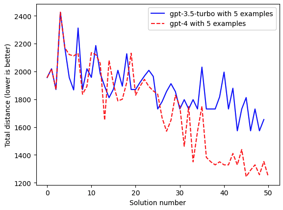

LLMs can find shorter solutions to the traveling salesman problem just by looking at existing solutions

## Background

Differentiable optimization is the basis of machine learning. From simple linear regression to complex deep neural networks, we calculate how output error changes with respect to model parameters and then change those parameters to (hopefully) help the model perform better at whatever problem it is being trained to solve.

LLMs are trained in the same way — lots of numbers are multiplied together, gradients are calculated and accumulated, and parameters are updated — all with the goal of doing a better job at predicting the next word.

As language models became larger and larger, it became clear that they could be excellent general problem solvers. When GPT-4 came out in March, it achieved [state of the art performance on dozens of exams and machine learning benchmarks](https://openai.com/research/gpt-4).

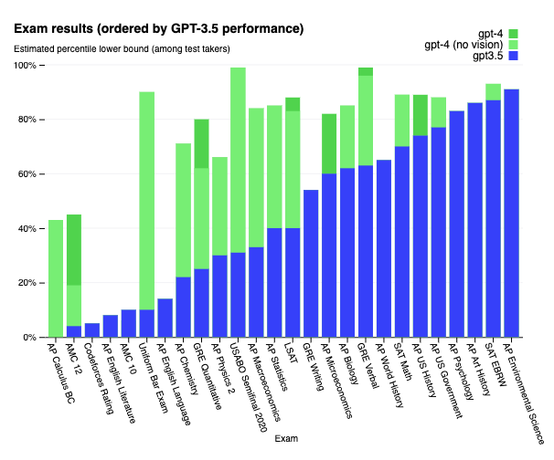

Another interesting characteristic of LLMs that became apparent is how sensitive they are to minor changes in the prompt. For example, simply telling an LLM to “think step by step” at the end of the problem statement can drastically improve its performance.[^1]

Other research has shown that many other techniques can help improve LLM problem-solving performance, such as:[^2]

- complimenting or thanking the model
- telling it to impersonate an expert
- giving a few examples
- providing a mock conversation about the problem as part of the prompt
- asking it to evaluate its own response
- asking it to break down the problem into smaller steps
- giving more specific instructions
- telling the model to format its response in a specific way

The discipline of figuring out how to get production LLMs to perform better at the task at hand (i.e., do what you tell them to do) has become known as [Prompt Engineering](https://www.mckinsey.com/featured-insights/mckinsey-explainers/what-is-prompt-engineering). Despite that fact that [HN tends to laugh at the term](https://news.ycombinator.com/item?id=34947153), the ability to get LLMs to do what you tell them to do has only become more valuable as more and more LLMs are integrated into products.

**Unfortunately**, there is no sure fire way to find the optimal prompt to get an LLM to do what you want it to do. You can take a pretrained language model and finetune it on a task that uses a consistent prompt and desires a consistent output, but finetuning is time-consuming and expensive. Alternatively, you can just try out different prompts and hopefully find something that works…but that’s also time consuming and feels hit-and-miss…

## Optimization by prompting

Optimization by prompting is almost exactly that, but automated. Per the paper:

> In this work, we propose Optimization by PROmpting (OPRO), a simple and effective approach to leverage large language models (LLMs) as optimizers, where the optimization task is described in natural language. In each optimization step, the LLM generates new solutions from the prompt that contains previously generated solutions with their values, then the new solutions are evaluated and added to the prompt for the next optimization step.

### Math problem example

As with most prompt engineering concepts, I think that it’s easier to understand with an example than by reading the description. Let’s start with the one that I implemented. In this case, there is a set of 20 points on the xy-plane, and the model is tasked with finding the shortest path through the points such that every point is visited and no point is visited more than once. This is an example of the [traveling salesman problem](https://en.wikipedia.org/wiki/Travelling_salesman_problem)*.*

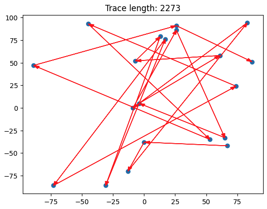

A randomly generated path where each point is visited only once

We try to find shorter paths through the points using the prompt below.

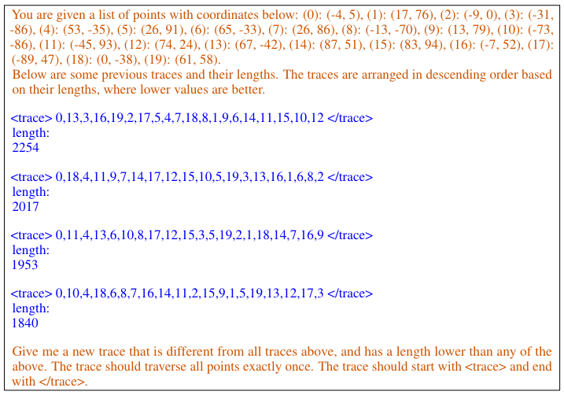

In this example, the orange text is the *metaprompt* and the blue text is a set of example solutions. By “looking” at the provided solutions, the model can infer what a better solution might be. Once the model produces a few solutions, you check to see if any of them are better (shorter) than the example solutions — if so, you update the example solutions and repeat the process until you’re happy. If everything went well, the model will have consistently found better and better solutions.

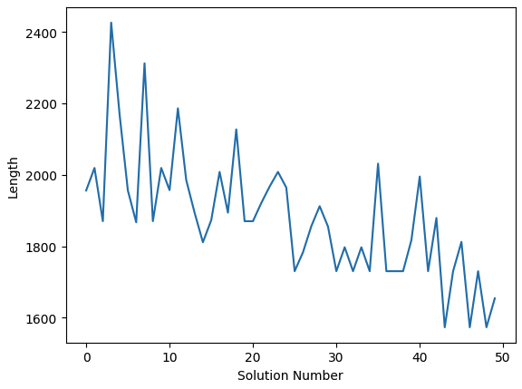

`gpt-3.5-turbo` using OPRO to find better solutions to the traveling salesman problem

### Prompt optimization example

This approach also works for prompt optimization.

For example, say you want to use a model to answer grade school math word problems (in this case, the authors use the [GSM8k dataset](https://paperswithcode.com/dataset/gsm8k)). As I mentioned above, minor changes to the instructions can have a large impact on how well the does at solving the problems. You can use OPRO to iteratively modify and improve your instruction prompt to improve the model’s performance.

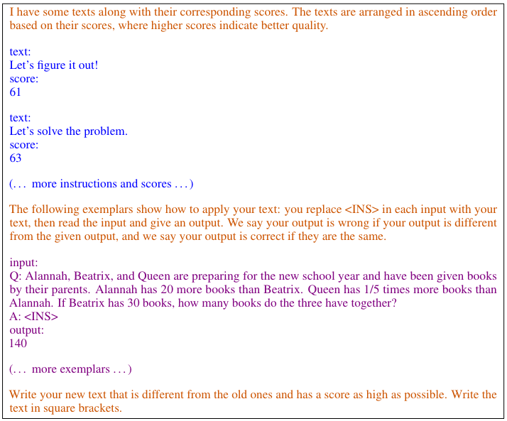

The purple text consists of example questions that an LLM might be asked — these show where the generated solutions (text phrases in this case) would be used in a question. The blue text are example solutions (text phrases) that were generated and the corresponding benchmark scores that were achieved with those phrases.

This example is a bit more confusing. Essentially, we are telling the model:

> “Hey, here are some example word problems (the purple text). You see the `<INS>` in each example? Think of a phrase you could substitute into that spot that would help a LLM do a better job at answering those questions. Also, here are some examples of previous phrases we’ve tried and how well they helped the LLM perform (the blue text).”

From there, you follow the same process as we did for the math problems. Get a few different text phrases from the model, substitute them into the instruction prompt, and then test those instruction prompts on the benchmark dataset. If any of the new phrases led to better performance, update your example solutions (the blue text above) in the OPRO prompt.

Using OPRO, the authors were able to achieve state-of-the-art results on several benchmarks with multiple models. The *Top Instruction* column shows which `<INS>` instruction performed best with each model — OPRO-generated instructions are in the bottom half (under the dotted line).

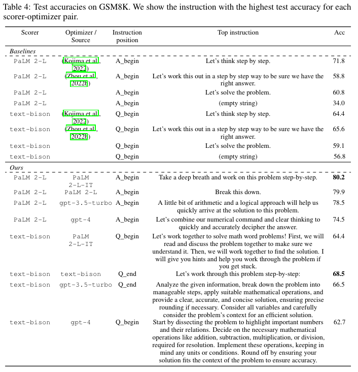

### Interesting OPRO tidbits

In addition to demonstrating optimization by prompting, the paper spends a lot of time discussing how different factors affect how well the optimization process works. Specifically:

- don’t show too few example solutions in the prompt, but also don’t show too many example solutions

  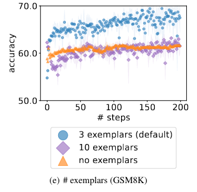

  Showing too many examples is almost as bad as showing too few examples (zero-shot prompting)
- how you order the example solutions in the prompt matters (ordering from *worst-to-best* is better than a random order or *best-to-worst* — perhaps because *worst-to-best* does a better job of demonstrating the optimization trajectory)

  

  Including example solutions in order or ascending score (where higher score is better) results in improved performance
- there is no clear guidance on where to put the `<INS>` instruction in a prompt — sometimes the model performs better if the instruction is at the start of the question, and sometimes it performs better when the instruction is at the end of the question
- a model temperature of 1 (the default value for [most models that have a temperature range of 0-2](https://platform.openai.com/docs/api-reference/chat/create)) results in the best performance — lower temperatures result in the model not exploring the solution space enough, and higher temperatures cause the model to ignore the trajectory of the example solutions

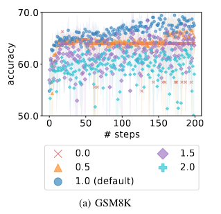

How model temperature affects accuracy

## My implementation

### The code

I chose to implement the traveling salesman problem as it is faster, cheaper, and easier to test. I can generate some traces, quickly determine their length, update the prompt, and repeat…if I were to try and implement prompt optimization on word problems, I’d have to test each generated solution on GSM8k, which would jack up my API costs and be very time intensive.

Step one is to generate a `MathPrompt` class — something that could store the metaprompt, all generated solutions, and which solutions to include in the prompt. This works with the traveling salesman problem, but could also work for any other generic math-type problem.

```
# let's create some classes that make managing prompts easier
@dataclass
class Solution:
    solution_name: str  # the name of the solution, e.g. "trace"
    solution_text: str  # the text solution to a problem
    value_name: str  # the name of the value used to measure the solution, e.g. "length" or "score"
    value: int  # the value of the solution, e.g. 5 or 10

class MathPrompt:
    def __init__(
        self,
        problem: str,  # text description of the problem to be solved
        instruction: str,  # instructions on what type of solution to provide and in what format
        solution_description: str,  # a description of the solutions and how they are ordered (e.g., "arranged in descending order based on their lengths, where lower values are better")
        example_count: int = 5,  # the maximum number of example solutions to include in the prompt string
        sort_ascending: bool = True,  # whether the solutions are sorted in ascending or descending order
    ):
        self.problem = problem
        self.solution_description = solution_description
        self.solutions = []
        self.instruction = instruction
        self.prompt_string = ""
        self.example_count = example_count
        self.sort_ascending = sort_ascending
        self.ordered_values = [] # the values of the solutions in the order they are determined by the model

    def update_prompt_string(self):
        """
        Creates a string representation of the prompt that can be used to display the prompt to the user or provide it to a language model.
        """
        # create a string representation of the last solution_count solutions
        all_solutions = [f"{solution.solution_name}: {solution.solution_text}\n{solution.value_name}: {solution.value}"
            for solution in self.solutions]
        all_solutions.reverse() # reverse the order so that the solutions with "best" value are first
        
        example_solutions = []
        for i, solution in enumerate(all_solutions):
            if i > self.example_count:
                break
            if solution not in example_solutions:
                example_solutions.append(solution)

        example_solutions.reverse()
        solutions_string = "\n\n".join(example_solutions)
                

        self.prompt_string = f"{self.problem}\n\n{self.solution_description}\n\n{solutions_string}\n\n{self.instruction}"

    def add_solution(self, solution: Solution):
        """
        Adds a solution to the list of solutions, sorts the list by value in ascending or descending order (depending on self.sort_ascending), and updates the prompt string.
        """
        self.solutions.append(solution)

        self.ordered_values.append(solution.value)

        # sort the solutions by value in ascending order
        self.solutions.sort(key=lambda solution: solution.value, reverse=not self.sort_ascending)

        self.update_prompt_string()

    def __repr__(self):
        return self.prompt_string
```

I then created a few helper functions to generate random solutions, calculate path lengths, and draw paths on a plot. In the end, I could easily generate a set of starting solutions and add them to the prompt. Here is an example:

```
You are given a list of points with coordinates below: (0): (-4, 5), (1): (17, 76), (2): (-9, 0), (3): (-31, -86), (4): (53, -35), (5): (26, 91), (6): (65, -33), (7): (26, 86), (8): (-13, -70), (9): (13, 79), (10): (-73, -86), (11): (-45, 93), (12): (74, 24), (13): (67, -42), (14): (87, 51), (15): (83, 94), (16): (-7, 52), (17): (-89, 47), (18): (0, -38), (19): (61, 58).

Below are some previous traces and their lengths. The traces are arranged in descending order based on their lengths, where lower values are better.

trace: <trace>2,18,11,4,9,7,14,12,17,15,5,10,19,3,13,16,1,6,8,0</trace>
length: 3017

trace: <trace>0,13,3,16,19,2,17,5,4,7,18,8,1,9,6,14,11,15,10,12</trace>
length: 2254

trace: <trace>0,4,18,11,9,7,14,17,12,5,10,15,19,3,13,16,1,6,8,2</trace>
length: 2016

trace: <trace>9,11,4,13,6,10,8,17,12,15,3,5,19,2,1,18,14,7,16,0</trace>
length: 1953

trace: <trace>11,0,4,13,6,10,8,17,12,3,15,5,19,2,1,18,14,7,16,9</trace>
length: 1952

Give me a new trace of comma-separated points that is different from all traces above, and has a length lower than any of the above. The trace should traverse all points exactly once. The trace should start with <trace> and end with </trace>. Return only the trace.
```

Note: I modified the metaprompt and trace structure slightly from the paper. I removed the leading and trailing spaces (after `<trace>` and before `</trace>`) and added “Return only the trace.” I did this because `gpt-3.5-turbo` and `gpt-4` were both doing a relatively poor job of returning properly formatted traces.

I then implemented OPRO in `solve_traveling_salesman()`. This function generates solutions, ensures that they’re formatted properly, and adds them to the `MathPrompt` class (which then updates the prompt). It stops after a set number of iterations or if too many iterations happen without improvement.

```
def solve_traveling_salesman(problem: MathPrompt, max_iters: int = 20, batch_size: int = 4, model = "gpt-3.5-turbo"):
    """
    Solves a traveling salesman problem using GPT-3.5-turbo.

    Args:
    - problem: a MathPrompt object
    - max_iters: the maximum number of iterations to run
    - batch_size: the number of solutions to generate per iteration
    """
    no_improvement_counter = 0
    failure_counter = 0
    api_count = 0
    for i in range(max_iters):
        solutions = []
        for j in range(batch_size):
            new_trace = get_new_trace(problem.prompt_string)
            new_length = calculate_trace_length(points, new_trace)

            if problem.sort_ascending:
                if new_length < problem.solutions[0].value:
                    no_improvement_counter += 1
            else:
                if new_length > problem.solutions[0].value:
                    no_improvement_counter += 1
            api_count += 1

            # if inf or -inf, then count a failure
            if new_length == math.inf or new_length == -math.inf:
                failure_counter += 1
            elif new_trace in solutions: # if the trace is a duplicate, count it as a failure
                failure_counter += 1
                print(f"Generated trace was a duplicate.")
            else: # only add valid solutions
                solutions.append(Solution("trace", new_trace, "length", new_length))

        for solution in solutions: # add all valid solutions from a batch at once
            problem.add_solution(solution)

        if no_improvement_counter > max_iters * batch_size / 2:
            print(f"Stopping early after {i} iterations without improvement.")
            break

    print(f"There were {failure_counter} failures out of {api_count} API calls.")
    return problem
```

Here’s what a run looks like, along with the final result. Note how `example_count=4` — this means I’m only ever showing the best four solutions to the model in the prompt.

```
gpt4_problem = MathPrompt(problem_statement, instruction, solution_description, example_count=4, sort_ascending=False)

for solution in starting_solutions:
    gpt4_problem.add_solution(solution)

solve_traveling_salesman(gpt4_problem, max_iters=12, model="gpt-4")
```

```
The trace should consist of comma-separated integers.
The trace should consist of comma-separated integers.
There were 2 failures out of 48 API calls.
You are given a list of points with coordinates below: (0): (-4, 5), (1): (17, 76), (2): (-9, 0), (3): (-31, -86), (4): (53, -35), (5): (26, 91), (6): (65, -33), (7): (26, 86), (8): (-13, -70), (9): (13, 79), (10): (-73, -86), (11): (-45, 93), (12): (74, 24), (13): (67, -42), (14): (87, 51), (15): (83, 94), (16): (-7, 52), (17): (-89, 47), (18): (0, -38), (19): (61, 58).

Below are some previous traces and their lengths. The traces are arranged in descending order based on their lengths, where lower values are better.

trace: <trace>19,5,7,4,13,6,18,2,0,9,8,11,16,1,15,12,14,17,3,10</trace>
length: 1328

trace: <trace>19,5,7,4,13,6,18,10,3,16,11,8,0,2,9,17,1,12,14,15</trace>
length: 1290

trace: <trace>19,5,7,4,13,6,18,3,10,2,0,8,9,11,16,1,17,14,15,12</trace>
length: 1257

trace: <trace>19,5,7,4,13,6,18,3,10,2,0,8,9,11,16,1,17,14,12,15</trace>
length: 1243

Give me a new trace of comma-separated points that is different from all traces above, and has a length lower than any of the above. The trace should traverse all points exactly once. The trace should start with <trace> and end with </trace>. Return only the trace.
```

### Results

Optimization by prompting works!

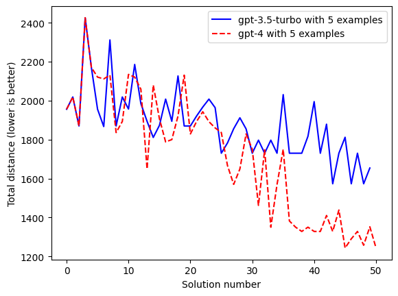

The above chart shows how `gpt-3.5-turbo` and `gpt-4` were both able to generate shorter paths, only by looking at existing examples. Just like the authors found, `gpt-4` unsurprisingly outperforms `gpt-3.5-turbo`.

Note: One thing I found interesting was that both `gpt-4` and `gpt-3.5-turbo` made roughly the same number of formatting errors (e.g., returned a improperly formatted trace). I would have expected `gpt-4` to perform much better.

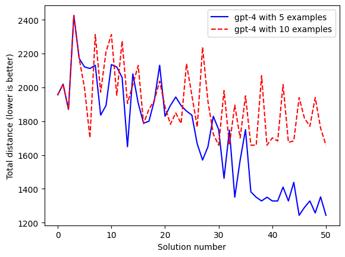

I was also able to replicate the paper’s results demonstrating how a smaller (but non-zero) number of example solutions leads to better performance than more examples.

I didn’t get a chance to replicate the effects of varying temperature or solution ordering…but I’ve been having lots of issues with the `gpt-4` API endpoint going down and don’t want to spend all day sitting at my computer.

## Conclusion

Optimization by prompting is pretty cool! Note that using it to solve simple math problems is obviously not very useful — if there are formal optimization methods available, you should use those as they will almost certainly be faster and cheaper.

However, I think OPRO has a lot of potential when it comes to modifying prompt instructions to improve model performance. For example, if you’re trying to extract text from documents into a certain JSON format and don’t want (or can’t) finetune your model, you could easily use OPRO and likely see a big bump in performance.

If you found this interesting, enjoyable, or helpful in any way, please let me know and feel free to share! You can find reach me at any of the social links on my profile page.

Thank you for reading On the Rocks. This post is public so feel free to share it.


<hr />

<div class="footnotes">

[^1]: *Large Language Models are Zero-Shot Reasoners (Kojima et al., 2023)*
[^2]: See [this paper](https://arxiv.org/pdf/2303.07142.pdf) for an interesting case study which shows how combinations of these techniques affect model performance for a particular problem.

</div>
