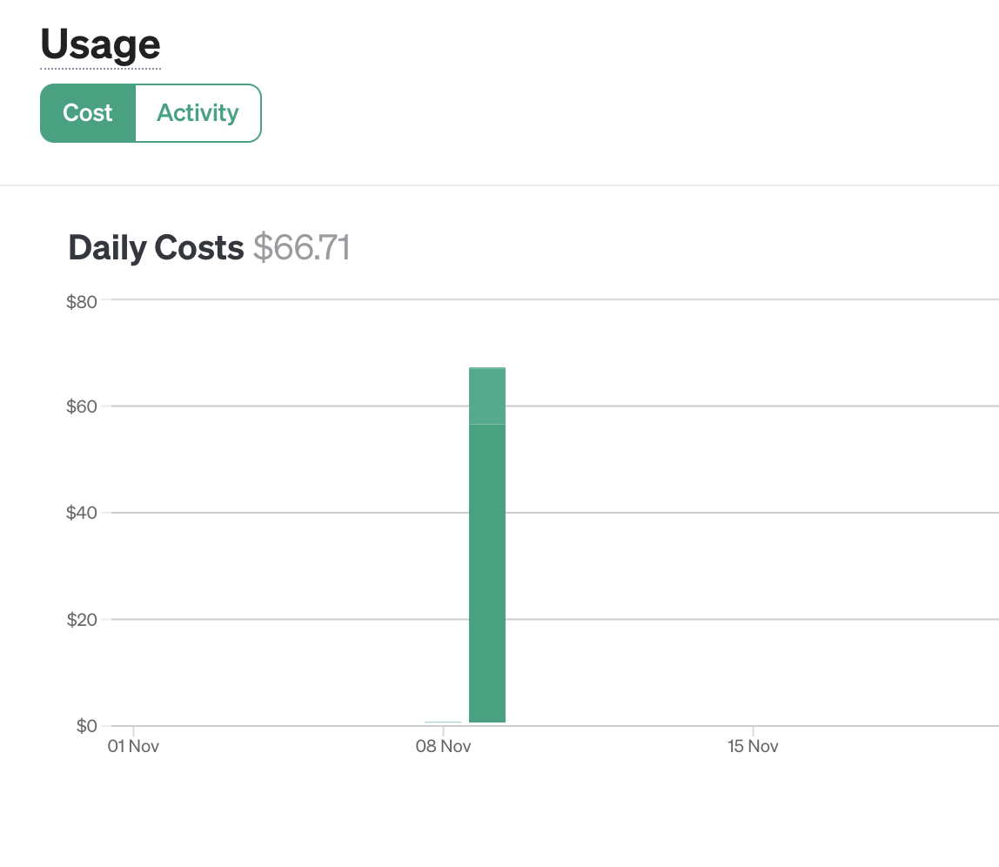
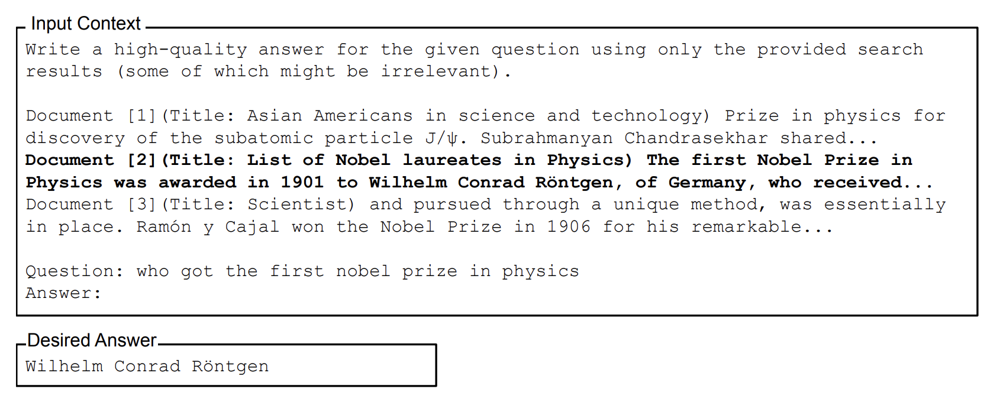
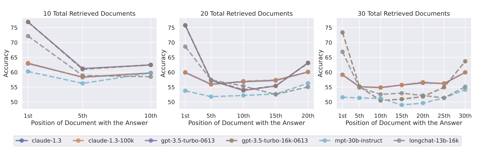
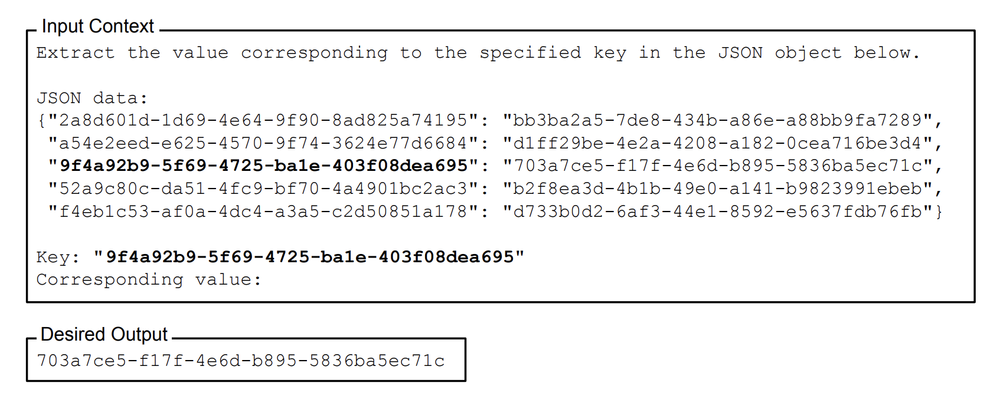
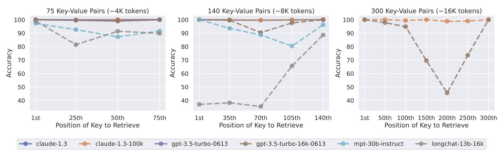
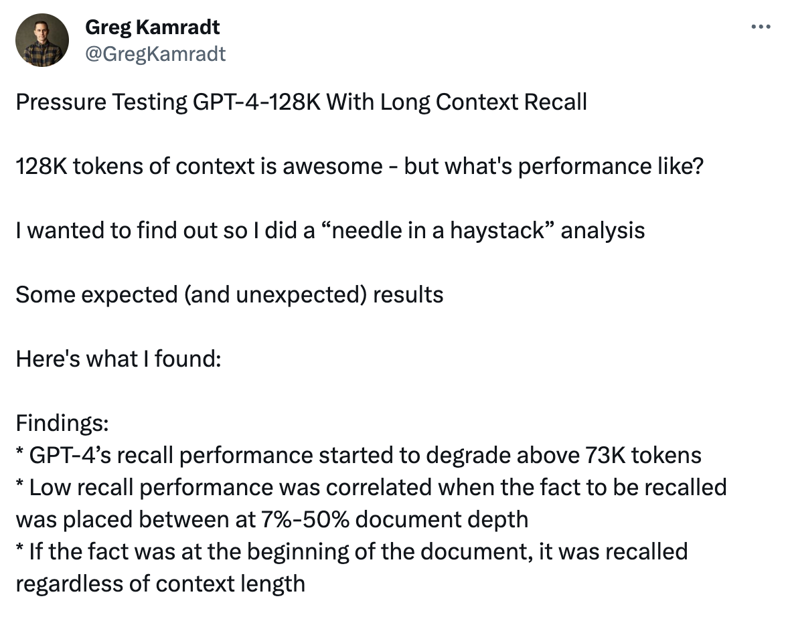
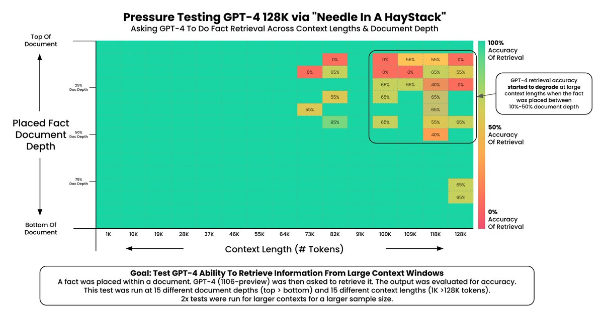
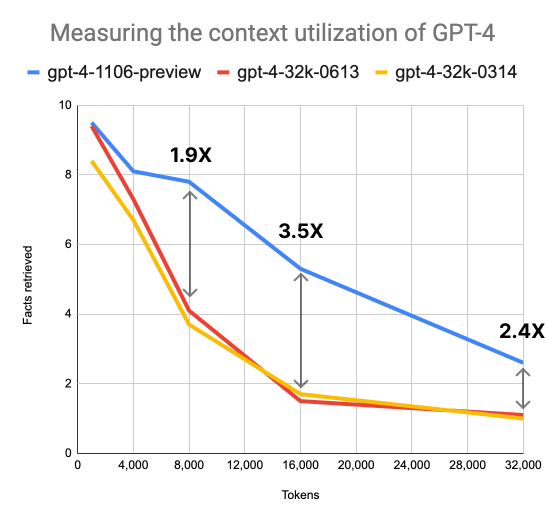

Jump to the takeaways [here](https://gcdavis.substack.com/i/138721000/takeaways).

You can find all the source code for this implementation in [this repo](https://github.com/davisgcii/lost-in-the-middle) on my [GitHub profile](https://github.com/davisgcii). Special thanks to Nelson Liu for putting in the original work for the *[Lost in the Middle](https://arxiv.org/abs/2307.03172)* paper.

**Note**: This post has some technical bits but the key takeaways should be understandable and valuable even to those without a background in machine learning!

# Intro

Earlier this week, OpenAI held their first [DevDay](https://openai.com/blog/new-models-and-developer-products-announced-at-devday) and, if you’re reading this post, you’ve probably heard about it already.

Some of the key highlights include a new framework for agents, an upcoming GPT marketplace, and the DALLE-3 API. However, the key launch underpinning all of this was their new model, GPT-4 Turbo.

GPT-4 Turbo is just GPT-4, but ✨*better*✨. Improvements include:

- A longer context window of 128k tokens (longer than your average novel).
- Vision capabilities, meaning that it can reason over both text and images.
- Simultaneous function calling.
- JSON mode and better instruction-following capabilities, meaning the model is much more likely to adhere to specified output formats and will do a better job at following instructions.
- Faster inference.
- Viewable token log probs.
- Cheaper pricing by about 2-3x compared to the standard GPT-4.

Already, there are a million interesting demos that people have built using the new capabilities, including: a [League of Legends announcer](https://twitter.com/pwang_szn/status/1721900523866214635), a [vimium AI browser-bot](https://github.com/ishan0102/vimGPT), a [chatbot you can talk to in real time about what’s on your screen](https://twitter.com/swyx/status/1722662234680340823), and more.

Again, a lot of the usability here is driven by the longer context window and stronger instruction-following capabilities. More context means the model can look at entire codebases, review more documents retrieved using retrieval-augmented generation, understand longer-range relationships in text, etc.

**However, not all context is equal.**

Today, I want to discuss how context length and location-in-context affects model performance. More generally, how much context should you provide to GPT-4 Turbo, where should you put the key pieces of information, and how does this compare to GPT-4 and other models?

Remember, remember, the 8th of November

# Lost in the Middle

## Background

Back in July, a team of researchers from Stanford, Berkeley, and [Samaya.ai](https://samaya.ai/) published a paper called *[Lost in the Middle: How Language Models Use Long Contexts](https://arxiv.org/abs/2307.03172)*. This paper was published right after a series of context window upgrades from both OpenAI and Anthropic, and it sought to formalize the prompt management community's tribal knowledge by answering two key questions:

1. Does model performance vary with the location of relevant information within the input context?
2. Do longer input contexts improve or degrade language model performance?

### Multi-document question-answering

They began by evaluating how well different models performed at a multi-document question-answering task. In this task, the model is provided with a set of documents, one of which has a key piece of information needed to answer the follow-on question.

An example prompt for the multi-document question-answering task. The bolded document is the one that contains the key information needed to answer the question.

Given the title of their paper, it’s unsurprising that they found that the location of relevant information and the length of context provided strongly affects model performance.

These plots show multi-document question-answering performance.

You can get the big picture from the plots above. In general, most models:

1. Did a better job answering questions when the relevant information was located near the beginning or end of the context window.
2. Did a better job at answering questions when the amount of provided context was shorter (see *10 Total Retrieved Documents* vs *30 Total Retrieved Documents*).

Interestingly, the team also discovered that, by providing long context or placing key information in the middle of the context, *some models performed worse at question-answering than had they been provided no context at all (zero-shot prompting)*.

> For example, GPT-3.5-Turbo’s open-book performance on the multi-document question task when relevant information is placed in the middle of its input context is lower than its performance when predicting without any documents (i.e., the closed-book setting; 56.1%).

### Information retrieval

These results also generally held true for *information retrieval* — a task where the model is effectively asked to quote a certain piece of information from its context.

To test this, the team provided the models with a large number of key-value pairs in json format and then asked the model to retrieve the value for a specific key (see example prompt below).

A sample prompt for the information retrieval task.

### Effects of prompting

Building on top of this research, the prompt engineering team at Anthropic conducted an [informal study on how to get the best performance out of a model’s long context window](https://www.anthropic.com/index/prompting-long-context). They generally saw the same results — model performance improves when:

1. The context window is shorter.
2. The key information needed to perform the task is located near the beginning or end of the context window.

Finally, they evaluated how different prompting techniques affected the model’s question-answering capabilities for different context lengths and key information positions. To summarize their findings, *providing more task examples (multi-shot prompting) and providing a “scratchpad” for the model to write relevant information before answering the question (a form of chain-of-thought prompting) helps offset the performance degradation of long context*.

## Why does this happen?

There are a few reasons for why this behavior might occur.

First, encoder-decoder models (like Flan-T5-XXL) might have a flatter performance curve because they are able to “process each document in the context of future documents”. In other words, because encoder-decoder models have a bidirectional encoder, the models are able to process the provided context (the documents or key-value pairs) in the context of the query (confusing wording, I know…).

In contrast, decoder-only models (like Claude and all OpenAI GPTs) “cannot attend to query tokens when contextualizing documents or key-value pairs, since the query only appears at the end of the prompt and decoder-only models can only attend to prior tokens at each timestep”.

To test this hypothesis, the research team re-ran the evaluations, this time with the query at both the beginning and end of the prompt (a technique they called *query-aware contextualization*). This would allow the decoder-only models to pay attention to the query when digesting the rest of the context.

> We find that query-aware contextualization dramatically improves performance on the key-value retrieval task. For example, GPT-3.5-Turbo (16K) (with query-aware contextualization) achieves perfect performance when evaluated with 300 key-value pairs. In contrast, without query-aware contextualization, it achieves a lowest performance of 45.6% in the same setting (Figure 10).  
>   
> In contrast, query-aware contextualization minimally affects performance trends in the multi-document question answering task. In particular, it improves performance when the relevant information is located at the very beginning of the input context, but slightly decreases performance in other settings.

### To put it more simply…

Language models, especially those based on the transformer architecture, often perform better when key information is located at the beginning or end of a text. This behavior stems from how the models are trained and the mechanics of self-attention.

You can improve model performance for long contexts by using "query-aware contextualization” — in other words, ask provide the main instructions or query at both the beginning and end of the prompt.

## How does GPT-4 Turbo stack up?

### My (simple) analysis

Given that a lot of the usefulness of GPT-4 Turbo is derived from the longer context window, I wanted to see how well it performed compared to the original GPT-4. Thankfully, the *Lost in the Middle* team open-sourced the code they used to evaluate the open source models like `mypt-30b` — I was able to reuse a lot of their boilerplate and only had to create a handful of files to evaluate an API-accessed commercial model like GPT-4 Turbo.

I quickly realized that this would be very expensive — let’s take a look at some quick math for the information evaluation they did for the base GPT-4:

$$
\text{cost}=\frac{$0.03}{\text{1000 tokens}}\*\frac{~330 \text{ tokens}}{\text{document}}\times \frac{20 \text{ documents}}{\text{example}}\times \frac{500 \text{ examples}}{\text{run}}\times 5 \text{ runs}=$495
$$

**This one evaluation cost them around $500! And they did many evaluations across many different models!**

If I wanted to perform the same evaluation on GPT-4 Turbo using its *entire* context window (500 128k-token-long examples for each of 5 runs at $1.28 per run), it would cost me about $3,200, much more money than I can justify.

Instead, I ran 5 examples for each of 5 runs, totaling $32. I also performed the information retrieval evaluation as opposed to the multi-document question-answering evaluation. Finally, I had to `sleep(100)` between each call to the GPT-4 Turbo API to avoid exceeding my 80k tokens-per-minute rate limit 😔.

The result: the expected U-shape curve.

**Note that these results are NOT statistically significant. I don’t have enough money to demonstrate statistical significance.**

In retrospect, I should have performed the multi-document question-answering evaluation instead so I could compare my results directly to the paper’s (they didn’t perform information-retrieval testing on GPT-4).

In any case, It’s interesting to see how much the performance drops off when the key information is located in the middle of the context window. Let’s compare it to the paper’s information-retrieval evaluation of GPT-3.5 Turbo:

Note how Claude generally has excellent value retrieval performance across all context window sizes while GPT-3.5 Turbo suffers from the “lost in the middle” effect as the context window size increases. The fact that Claude performs so well while both GPT-4 Turbo and GPT-3.5 Turbo degrade might imply an architectural or training difference between the two classes of models.

### Let’s see what’s on X (fka Twitter 😑)

Fortunately, others in the community have deeper pockets than I and were more willing to try and stress-test OpenAI’s datacenter cooling systems.

[@GregKamradt](https://twitter.com/GregKamradt) performed his own analysis, testing a large cross-section of context lengths and key-information positions, with a heightened focus on longer context windows.

**Note that these results are** ***also*** **[NOT statistically significant](https://x.com/LGaneline/status/1722474888274096284?s=20).**

His analysis was more similar to the paper’s multi-document question-answering evaluation — he:

1. Stuffed the context window full of [Paul Graham](http://www.paulgraham.com/articles.html) essays.
2. Hid a sneaky sentence somewhere in the context (“The best thing to do in San Francisco is eat a sandwich and sit in Dolores Park on a sunny day.”).
3. Asked GPT-4 Turbo what the best thing to do in San Francisco is.

If the model said something along the lines of “eating a sandwich and sitting in Dolores Park on a sunny day”, it was graded a correct answer.

The results show that GPT-4 Turbo generally does much better using context from GPT-4’s original 32k-token window but still struggles with middle-of-window retrieval at larger context sizes (70k tokens plus).

[@LouisKnightWebb](https://twitter.com/LouisKnightWebb) performed another analysis — primarily to measure the effect of context window size on accuracy — and found similar results. GPT-4 Turbo outperforms GPT-4 and GPT-3.5 Turbo by a large margin, but still struggles at larger context sizes. In this particular analysis, Louis fills the context window with sentences like:

`My name is ${randomName} and I am from ${randomCountry} and I have a pet ${randomAnimal}.`

He then randomly inserts 10 sentences where the person has a random *fruit* instead and asks the model to provide the names of people who have a pet fruit instead of a pet animal. The model is graded on how many names it could correctly retrieve. For example, the plot below shows that, with a context size of 32k tokens, GPT-4 Turbo correctly retrieved 2.4 names on average compared to the 1.1 names that GPT-4 (base) correctly retrieved on average.

**Note that this test did not assess how the** ***location*** **of key information affected model performance and is also not statistically significant.**

# Takeaways

In the end, what matters is knowing how to best take advantage of GPT-4 Turbo’s huge context window. Here are some actionable takeaways:

- **Shorter contexts**: Strive to keep context windows concise; unnecessary length can hinder model performance.
- **Strategic information placement**: Position crucial information near the start or end of the context window. Bias toward the end of the context window if possible.
- **Query-aware contextualization**: Place the query at both the beginning and end of the context to improve information retrieval.
- **RAG and multi-shot prompting help, but keep it relevant**: Examples or documents that aren’t relevant to the provided task can hinder performance.

## Next steps

I would love to recreate more evaluations (at a statistically significant scale) from the *Lost in the Middle* paper. If you’re interested in helping fund this endeavor, please reach out and let me know!

Thank you for reading On the Rocks. This post is public so feel free to share it.

## Acknowledgements

Finally, thanks to everyone who has put in work to contribute to community knowledge!
