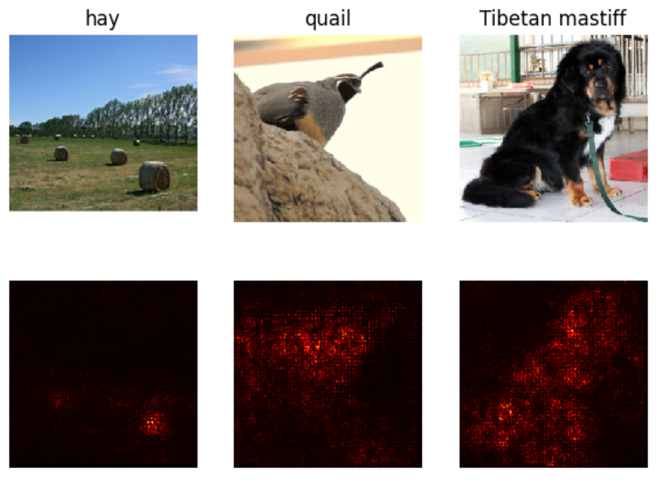
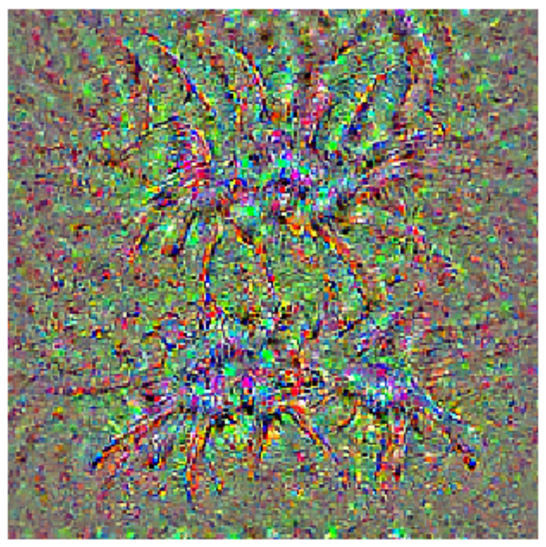
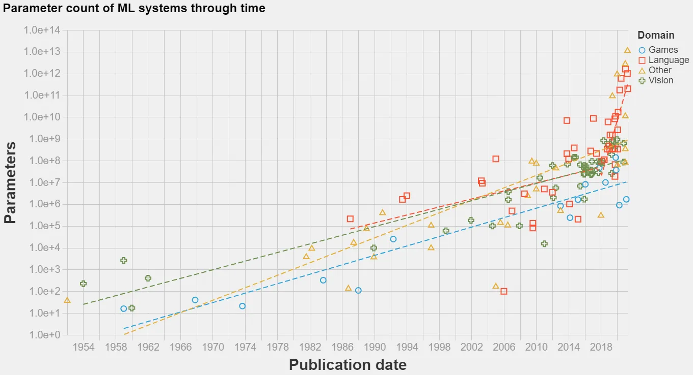

# **Intro**

Hello everyone! I’m George Davis, a former nuclear submarine officer and recent Stanford grad. In 2021, I left the Navy to and started at Stanford’s Graduate School of Business with the goal pivoting into a product role at an AI-focused company. During my time at Stanford, I’ve spent nearly a third of my units (and more than a third of my time!) taking computer science courses “across the street” and building side projects in my spare time. With everything going on in AI, Stanford is an incredibly exciting place to be — it truly feels like we are experiencing a moment that will go down in the history books.

That’s why I decided to conduct independent research this quarter under Professor Andrew Hall on the subject. I’ve been keeping on top of new research, talking to some of the brilliant minds working in the field here on campus, and building in the space on my own. I’ve begun to compile my notes on the topic and thought it might be helpful to share them with others who want a bit more context on what’s happening, what’s next, and some musings on the future of science, business, and humanity. Hopefully, it will stay light, educational, and amusing – bite-sized chunks built for a busy schedule**.**

Today, I’ll start by talking about the thing that has made this recent revolution possible – the Transformer.

# **Backstory**

Machine learning has a rich history that predates the advent of transformer models. Its origins can be traced back to the 1940s and 1950s, when early researchers explored mathematical algorithms and techniques to enable computers to learn from data. During the 1960s and 1970s, foundational machine learning techniques, such as decision trees, k-nearest neighbors, and support vector machines, were developed. The 1980s witnessed the emergence of artificial neural networks, particularly the backpropagation algorithm, which enabled multilayer perceptron models to learn from labeled data. In the 1990s and 2000s, machine learning continued to evolve with the advent of ensemble methods, such as boosting and bagging, and the popularization of kernel methods, which led to significant advances in performance.

The late 2000s saw the rise of deep learning, a subfield of machine learning focused on large neural networks with many layers. Breakthroughs in this area, particularly with the successful application of convolutional neural networks (CNNs) to image classification and recurrent neural networks (RNNs) to sequential data, set the stage for the development of transformers and the next wave of machine learning innovation. This is an incredibly simplified and high level summary, but it helps me set the stage to understand where transformers came from.

# **The Rise of Transformers**

In 2017, a landmark paper titled "Attention is All You Need" penned by Vaswani et al. introduced a novel concept that significantly altered the course of AI research - the Transformer. This idea was a radical departure from the established norms of AI architectures at the time, which were predominantly based on RNNs and CNNs.

Fast forward six years, and transformers have not just caught on, they've practically taken over. Today, the vast majority of large-scale models released, regardless of their intended application, from text generation to image captioning, are transformer-based. This paradigm shift is a testament to the power and versatility of the transformer.

# Unpacking the Buzzword

A Transformer is a type of deep learning architecture that can be used as a layer in a neural network. In the world of deep learning, these networks are built by stacking layers – like transformers, convolutional layers, or linear layers – on top of each other, just like a kid might stack different lego blocks on top of each other.

These layers all function differently but broadly accomplish the same purpose – they can *learn* deep, hidden relationships among data points. For example, a convolutional layer *scans* over an input (typically an image or the output of another convolutional layer) left to right, top to bottom, and outputs a big array of numbers. By *training* this network, we can encourage this layer to, over time, become capable of detecting features that might help classify what the input image is. To illustrate, the layer may learn that a certain set of edges grouped in a certain way is a likely indicator that the object in an image is a cat.

###### **Figure 1: The red pixels indicate what parts of the image this CNN is paying attention to when classifying each of these images (courtesy of George’s CS231n homework).**

###### **Figure 2: What one CNN expects a** ***tarantula*** **to look like (courtesy of George’s CS231n homework)**

In contrast, a recurrent layer cycles through an input (typically an ordered sequence, like written text) one step at a time, and uses information from previous steps to help generate its output. This is useful when there's some kind of temporal or sequential relationship in the data, like how the words in a sentence only make sense when they follow each other in certain orders.

Enter the transformer. Just like these other layers, it's a way of processing and interpreting data. It takes a sequence (like a paragraph in a book or a set of image features from a convolutional layer) as input, and can produce an output that also considers the relationships between different elements in that sequence. However, it has a couple of key features that have caused it to become the cornerstone of today’s large AI models.

# **The Mechanisms of Transformers**

Transformers stand out through their unique method of processing data. Unlike traditional machine learning models that employ recurrence or convolutions, transformers employ a concept called *attention*, and more specifically, *self-attention*. This approach enables transformers to break free from processing input data in a fixed order, as is the case with other models that handle sequential data (like RNNs). Instead, transformers have the ability to process all elements of the input data simultaneously, making them adept at handling large amounts of sequential information in an efficient manner.

Before diving into the nitty-gritty, let's first understand what *attention* is. In the simplest terms, attention mechanisms allow a model to weigh and consider different parts of the input when producing an output. They enable the model to *focus* more on certain parts of the input that are more important for the current task. It's like when we, as humans, pay more attention to the speaker in a noisy room, essentially amplifying the speaker's voice and dampening the background noise. Let’s look at an example:

*The **quick** **brown** **FOX** **jumps** over the lazy dog.*

As humans, we’ve learned to understand that the words most associated with the word “fox” are “quick”, “brown”, and “jumps” – each of these words directly corresponds to a description of the fox or something that the fox is doing.

*The quick brown **fox** **JUMPS** **over** the lazy **dog**.*

Similarly, the words most relevant to the word “jumps” are “fox”, “over”, and “dog” – the fox is what is doing the jumping, over describes how the jumping is being done, and the dog is what is being jumped over.

Where *self*-attention comes into play is how it lets the model decide how much weight or *attention* to give to each of these relationships. Maybe it decides that "brown" is particularly important, so it gives that relationship more weight. At the same time, it might decide that "the" is less important, so it gives that relationship less weight. This flexible, context-specific weighting allows the model to capture the context more accurately.

Although RNNs are also capable of understanding sequential relationships (this task is what they were built for!), they suffered from the fact that, with longer input sequences, the influence of earlier inputs on later outputs diminishes over time. Self-attention helps alleviate this issue by allowing each output to consider all inputs simultaneously, which helps to capture long-distance relationships in the input data more effectively.

In essence, self-attention gives transformers the ability to maintain a high-resolution understanding of the full context of the data they're processing, regardless of its order or sequence. It's allowed transformers to perform exceptionally well on tasks where understanding context and maintaining complex relationships between data points are crucial, such as language translation, text generation, summarization, and question-answering tasks.

# **The Transformer Advantage**

Because transformers can process an entire input sequence simultaneously (as opposed to in a fixed order, step by step), they are capable of being trained much more efficiently – in a “parallelizable” manner on many GPUs – than sequential models like RNNs. This jump in speed and efficiency means that, for the same amount of available computation power and training time, transformers-based models can be built much “larger”, trained on more data, and trained for much longer than any previous model architecture.

###### **Figure 3: Transformers have unlocked the ability to train incredibly large models, on the order of hundreds of billions of parameters. Note the rapid increase in model size immediately following the release of the** ***Attention*** **paper (courtesy of [Jaime Sevilla](https://towardsdatascience.com/parameter-counts-in-machine-learning-a312dc4753d0))**

It is this unlocking of scale that has unleashed the current AI revolution. Models like OpenAI's ChatGPT and GPT-4, or Meta’s Llama, all transformer-based, exemplify this. These models, containing billions of parameters, have been used for a variety of tasks, from generating human-like text to answering complex questions, demonstrating the scalability of transformer architecture.

# **Conclusion**

Thank you for joining me on this journey, and I hope that this post has demystified how today’s AI revolution was initiated. The rise of transformers has undeniably been a paradigm shift in the field of AI, enabling new scale and capabilities that were not feasible with previous models. If you have any questions, don't hesitate to reach out!
